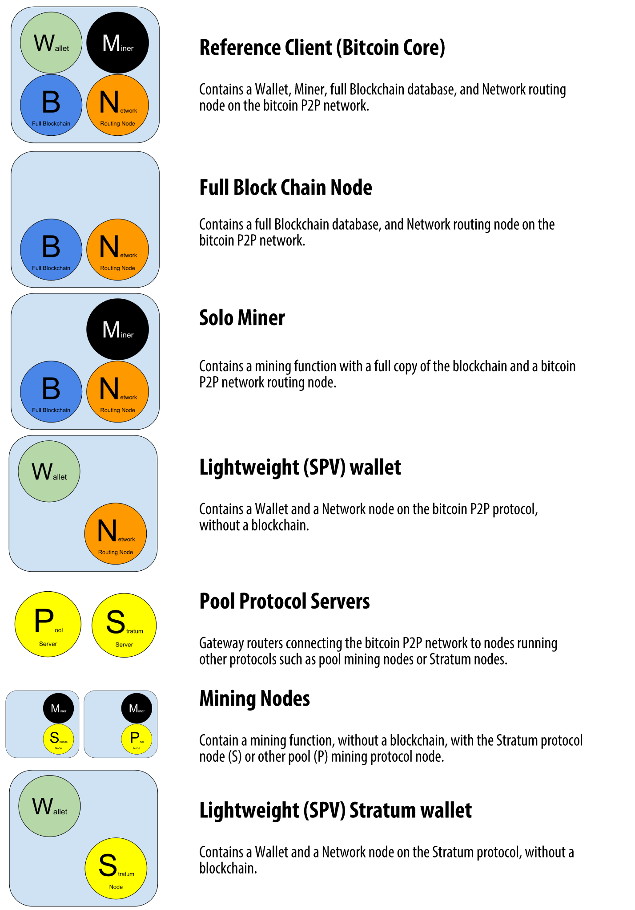
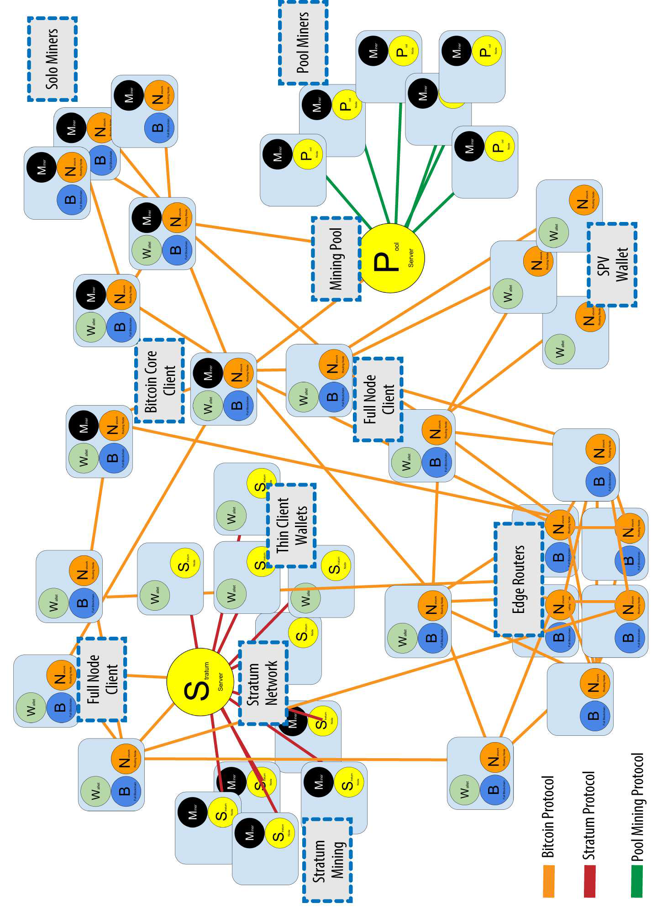

# Mastering Bitcoin

Bitcoin is not simply a digital currency, but a network of trust that could also provide
the basis for so much more than just currencies. It isn’t money, it’s a decentralized
trust network. it was the most exciting technology I had encountered since the internet.

This book will teach you how cryptographic currencies work, how to use them, and how to
develop software that works with them.

Nature demonstrates that decentralized systems can be resilient and can produce emergent
complexity and incredible sophistication without the need for a central authority,
hierarchy, or complex parts.

Bitcoin is a highly sophisticated decentralized trust network that can support myriad
financial processes. The bitcoin network is a resilient network of simple nodes following
simple rules that together can do amazing things without any central coordination.

In the rest of this book we will examine the specific technologies behind wallets,
addresses, signatures, transactions, the network, and finally mining.

## CHAPTER 1: Introduction

### What Is Bitcoin?

Bitcoin is a collection of concepts and technologies that form the basis of a digital
money ecosystem. The coins are implied in transactions that transfer value from sender to
recipient.

Users of bitcoin own keys that allow them to prove ownership of bitcoin in the bitcoin
network. With these keys they can sign transactions to unlock the value and spend it by
transferring it to a new owner.

Possession of the key that can sign a transaction is the only prerequisite to spending
bitcoin, putting the control entirely in the hands of each user.

bitcoin is also the name of the protocol, a peer-to-peer network, and a distributed
computing innovation.

### History of Bitcoin

The bitcoin network started in 2009, based on a reference implementation published by
Nakamoto with the publication of a paper
titled "[Bitcoin: A Peerto- Peer Electronic Cash System](https://bitcoin.org/bitcoin.pdf)
."

### Bitcoin Uses, Users, and Their Stories

Bitcoin is an innovation in the ancient technology of money. At its core, money simply
facilitates the exchange of value between people like retail, contract services, Web
store, and Charitable donations

### Getting Started

Bitcoin is a protocol that can be accessed using a client application that speaks the
protocol. A "bitcoin wallet" is the most common user interface to the bitcoin system.

#### Choosing a Bitcoin Wallet

Bitcoin wallets can be categorized as follows, according to the platform:

* A desktop wallet was the first type of bitcoin wallet created as a reference
  implementation and many users run desktop wallets for the features, autonomy, and
  control they offer.
* A mobile wallet is the most common type of bitcoin wallet. Running on smartphone
  operating systems such as Apple iOS and Android, these wallets are often a great choice
  for new users.
* Web wallets are accessed through a web browser and store the user’s wallet on a server
  owned by a third party.
* Hardware wallets are devices that operate a secure self-contained bitcoin wallet on
  special-purpose hardware.
* The keys controlling bitcoin can also be printed for long-term storage. These are known
  as paper wallets even though other materials (wood, metal, etc.) can be used.

Another way to categorize bitcoin wallets is by their degree of autonomy and how they
interact with the bitcoin network:

* Full-node client, a client that stores the entire history of bitcoin transactions (every
  transaction by every user, ever), manages users’ wallets, and can initiate transactions
  directly on the bitcoin network.
* Lightweight client, A lightweight client, also known as a simple-payment-verification (
  SPV) client, connects to bitcoin full nodes (mentioned previously) for access to the
  bitcoin transaction information, but stores the user wallet locally and independently
  creates, validates, and transmits transactions. Lightweight clients interact directly
  with the bitcoin network, without an intermediary.
* hird-party API client, A third-party API client is one that interacts with bitcoin
  through a third-party system of application programming interfaces (APIs), rather than
  by connecting to the bitcoin network directly. The wallet may be stored by the user or
  by thirdparty servers, but all transactions go through a third party.

A mobile wallet is best for new users like Mycelium and Exodus.

A wallet is simply a collection of addresses and the keys that unlock the funds within.
Bitcoin addresses start with a 1 or 3. They can be shared with other bitcoin users who can
use them to send bitcoin directly to your wallet.

Until the moment this address is referenced as the recipient of value in a transaction
posted on the bitcoin ledger, the bitcoin address is simply part of the vast number of
possible addresses that are valid in bitcoin. Only once it has been associated with a
transaction does it become part of the known addresses in the network.

#### Getting Your First Bitcoin

* Find a friend who has bitcoin and buy some from him or her directly
* Use a bitcoin ATM in your city, [https://coinatmradar.com/](https://coinatmradar.com/)
* Use a bitcoin currency exchange,
  [https://www.forbes. com/advisor/investing/cryptocurrency/best-crypto-exchanges/](https://www.forbes.com/advisor/investing/cryptocurrency/best-crypto-exchanges/)
  [https://www.investopedia.com/best-crypto-exchanges-5071855](https://www.investopedia.com/best-crypto-exchanges-5071855)

#### Finding the Current Price of Bitcoin

"Who sets the bitcoin price?" The short answer is that the price is set by markets.

#### Sending and Receiving Bitcoin

Source Bitcoin wallet constructs a transaction that assigns BTC to the destination address
and signing the transaction with source private keys. This tells the bitcoin network that
source has authorized a transfer of value to destination’s new address. As the transaction
is transmitted via the peer-to-peer protocol, it quickly propagates across the bitcoin
network.

Destination’s wallet is constantly "listening" to published transactions on the bitcoin
network, looking for any that match the addresses in his wallets.

the transaction has been propagated to the network but has not yet been recorded in the
bitcoin transaction ledger, known as the blockchain. To be confirmed, a transaction must
be included in a block and added to the blockchain

## CHAPTER 2: How Bitcoin Works

### Transactions, Blocks, Mining, and the Blockchain

we will examine bitcoin from a high level by tracking a single transaction through the
bitcoin system and watch as it becomes "trusted" and accepted by the bitcoin mechanism of
distributed consensus and is finally recorded on the blockchain, the distributed ledger of
all transactions.

#### Bitcoin Overview

A blockchain explorer is a web application that operates as a bitcoin search engine, in
that it allows you to search for addresses, transactions, and blocks and see the
relationships and flows between them. Popular blockchain explorers
include [Blockchain Block Explorer](https://www.blockchain.com/explorer)

a Bitcoin payment request is a QR-encoded URL that contains a destination address, a
payment amount, and a generic description

### Bitcoin Transactions

a transaction tells the network that the owner of some bitcoin value has authorized the
transfer of that value to another owner. The new owner can now spend the bitcoin by
creating another transaction that authorizes transfer to another owner, and so on, in a
chain of ownership.

#### Transaction Inputs and Outputs

Each transaction contains one or more "inputs," which are like debits against a bitcoin
account. On the other side of the transaction, there are one or more "outputs," which are
like credits added to a bitcoin account.

The inputs and outputs (debits and credits) do not necessarily add up to the same amount.
Instead, outputs add up to slightly less than inputs and the difference represents an
implied transaction fee, which is a small payment collected by the miner who includes the
transaction in the ledger.

The transaction also contains proof of ownership for each amount of bitcoin (inputs)
whose value is being spent, in the form of a digital signature from the owner, which can
be independently validated by anyone. In bitcoin terms, "spending" is signing a
transaction that transfers value from a previous transaction over to a new owner
identified by a bitcoin address. Figure

#### Transaction Chains

The transactions form a chain, where the inputs from the latest transaction correspond to
outputs from previous transactions.

Destination or receiver’s key provides the signature that unlocks those previous
transaction outputs,

#### Making Change

Many bitcoin transactions will include outputs that reference both an address of the new
owner and an address of the current owner, called the change address. This is because
transaction inputs, like currency notes, cannot be divided. The change address does not
have to be the same address as that of the input and for privacy reasons is often a new
address from the owner’s wallet.

Transactions move value from transaction inputs to transaction outputs. An input is a
reference to a previous transaction’s output, showing where the value is coming from. A
transaction output directs a specific value to a new owner’s bitcoin address and can
include a change output back to the original owner. Outputs from one transaction can be
used as inputs in a new transaction, thus creating a chain of ownership as the value is
moved from owner to owner.

#### Common Transaction Forms

The most common form of transaction is a simple payment from one address to another, which
often includes some “change” returned to the original owner. This type of transaction has
one input and two outputs.

Another common form of transaction is one that aggregates several inputs into a single
output. This represents the real-world equivalent of exchanging a pile of coins and
currency notes for a single larger note. Transactions like these are sometimes generated
by wallet applications to clean up lots of smaller amounts that were received as change
for payments.

Another transaction form that is seen often on the bitcoin ledger is a transaction that
distributes one input to multiple outputs representing multiple recipients

### Constructing a Transaction

Sender's wallet application contains all the logic for selecting appropriate inputs and
outputs to build a transaction to his specification.

#### Getting the Right Inputs

Most wallets keep track of all the available outputs belonging to addresses in the wallet.

A bitcoin wallet application that runs as a fullnode client actually contains a copy of
every unspent output from every transaction in the blockchain. This allows a wallet to
construct transaction inputs as well as quickly verify incoming transactions as having
correct inputs. However, because a full-node client takes up a lot of disk space, most
user wallets run “lightweight” clients that track only the user’s own unspent outputs.

If the wallet application does not maintain a copy of unspent transaction outputs, it can
query the bitcoin network to retrieve this information using a variety of APIs available
by different providers or by asking a full-node using an API.

#### Creating the Outputs

A transaction output is created in the form of a script that creates an encumbrance on the
value and can only be redeemed by the introduction of a solution to the script. like “This
output is payable to whoever can present a signature from the key corresponding to
receiver’s public address.”

#### Adding the Transaction to the Ledger

The transaction created by Source’s wallet application is 258 bytes long and contains
everything necessary to confirm ownership of the funds and assign new owners. Now, the
transaction must be transmitted to the bitcoin network where it will become part of the
blockchain.

##### Transmitting the transaction

Because the transaction contains all the information necessary to process, it does not
matter how or where it is transmitted to the bitcoin network. The bitcoin network is a
peer-to-peer network, with each bitcoin client participating by connecting to several
other bitcoin clients. The purpose of the bitcoin network is to propagate transactions and
blocks to all participants.

##### How it propagates

Any system, such as a server, desktop application, or wallet, that participates in the
bitcoin network by “speaking” the bitcoin protocol is called a bitcoin node. Sender’s
wallet application can send the new transaction to any bitcoin node it is connected to
over any type of connection.

Any bitcoin node that receives a valid transaction it has not seen before will immediately
forward it to all other nodes to which it is connected, a propagation technique known as
**flooding**. Thus, the transaction rapidly propagates out across the peer-topeer network,
reaching a large percentage of the nodes within a few seconds.

##### Receiver or Destination’s view

If sender’s bitcoin wallet application is directly connected to receiver’s wallet
application, destination’s wallet application might be the first node to receive the
transaction. receiver’s wallet will immediately identify sender’s transaction as an
incoming payment because it contains outputs redeemable by receiver’s keys. At this point
receiver can assume, with little risk, that the transaction will shortly be included in a
block and confirmed. Although confirmations ensure the transaction has been accepted by
the whole network, such a delay is unnecessary for small-value items

### Bitcoin Mining

Sender’s transaction is now propagated on the bitcoin network. It does not become part of
the blockchain until it is verified and included in a block by a process called mining.
The mining process serves two purposes in bitcoin:

* Mining nodes validate all transactions by reference to bitcoin’s consensus rules.
* Mining creates new bitcoin in each block, almost like a central bank printing new money.

### Mining Transactions in Blocks

New transactions are constantly flowing into the network from user wallets and other
applications. As these are seen by the bitcoin network nodes, they get added to a
temporary pool of unverified transactions maintained by each node. As miners construct a
new block, they add unverified transactions from this pool to the new block and then
attempt to prove the validity of that new block, with the mining algorithm
(Proof-of-Work).

Transactions are added to the new block, prioritized by the highest-fee transactions first
and a few other criteria. Each miner starts the process of mining a new block of
transactions as soon as he receives the previous block from the network.

He immediately creates a new block, fills it with transactions and the fingerprint of the
previous block, and starts calculating the Proof-of-Work for the new block. Each miner
includes a special transaction in his block, one that pays his own bitcoin address the
block reward plus the sum of transaction fees from all the transactions included in the
block.

Sender’s transaction was picked up by the network and included in the pool of unverified
transactions. Once validated by the mining software it was included in a new block, called
a candidate block, generated by miner’s mining pool.

### Spending the Transaction

Now that Sender’s transaction has been embedded in the blockchain as part of a block, it
is part of the distributed ledger of bitcoin and visible to all bitcoin applications.

Lightweight clients can do what is called a simplified payment verification by confirming
that the transaction is in the blockchain and has several blocks mined after it, thus
providing assurance that the miners accepted it as valid.

## CHAPTER 3: Bitcoin Core: The Reference Implementation

Bitcoin is an open source project and the source code is available under an open
(MIT) license, free to download and use for any purpose.

Bitcoin Core is the reference implementation of the bitcoin system, meaning that it is the
authoritative reference on how each part of the technology should be implemented.

Bitcoin Core implements all aspects of bitcoin, including wallets, a transaction and block
validation engine, and a full network node in the peer-to-peer bitcoin network.

Application developers are advised to build wallets using modern standards such as BIP-39
and BIP-32

The Bitcoin Core architecture consists of the following main components:


### Bitcoin Development Environment

you will want to set up a development environment with all the tools, libraries, and
support software for writing bitcoin applications.

### Compiling Bitcoin Core from the Source Code

Bitcoin Core’s source code can be downloaded as a ZIP archive or by cloning the
authoritative source repository from
the [GitHub bitcoin page](https://github.com/bitcoin/bitcoin).

the git command to create a local copy (“clone”) of the source code:

```shell
$ git clone https://github.com/bitcoin/bitcoin.git
```

#### Selecting a Bitcoin Core Release

Before compiling the code, select a specific version by checking out a release tag. to
find the available tags, we use the `git tag` command. To synchronize the local code with
specific tag, use the `git checkout` command:

```shell
$ git checkout v0.11.2
```

You can confirm you have the desired version “checked out” by issuing the command
`git status`.

#### Configuring the Bitcoin Core Build

The source code includes documentation, which can be found in a number of files. Review
the main documentation located in README.md in the bitcoin directory. Carefully review the
build prerequisites. Review the instructions for compiling the bitcoind commandline client
on your platform.

#### Building the Bitcoin Core Executables

Next, you will compile the source code, a process that can take up to an hour to complete,
depending on the speed of your CPU and available memory. Type `make` to start compiling
the executable application.

If all goes well, Bitcoin Core is now compiled. The final step is to install the various
executables on your system using the sudo make install command.

### Running a Bitcoin Core Node

Bitcoin’s peer-to-peer network is composed of network “nodes,” run mostly by volunteers
and some of the businesses that build bitcoin applications. by running a bitcoin node you
contribute to the bitcoin network by making it more robust.

Running a node, however, requires a permanently connected system with enough resources to
process all bitcoin transactions. Bitcoin nodes also transmit and receive bitcoin
transactions and blocks, consuming internet bandwidth.

Bitcoin Core keeps a full copy of the blockchain by default, with every transaction that
has ever occurred on the bitcoin network since its inception in 2009. Bitcoin Core will
not be able to process transactions or update account balances until the full blockchain
dataset is downloaded.

You would run a Bitcoin node for the following reasons:

* If you are developing bitcoin software and need to rely on a bitcoin node for
  programmable
  (API) access to the network and blockchain.
* If you are building applications that must validate transactions according to bitcoin’s
  consensus rules.
* If you want to support bitcoin. Running a node makes the network more robust and able to
  serve more wallets, more users, and more transactions.
* If you do not want to rely on any third party to process or validate your transactions.

#### Running Bitcoin Core for the First Time

When you first run `bitcoind`, it will remind you to create a configuration file with a
strong password for the JSON-RPC interface. Run bitcoind by typing `bitcoind` into the
terminal.

#### Configuring the Bitcoin Core Node

Edit the configuration file in your preferred editor and set the parameters, replacing the
password with a strong password as recommended by bitcoind. Typical path to configuration
file:
Windows %APPDATA%\Bitcoin\ C:\Users\username\AppData\Roaming\Bitcoin\bitcoin.conf Linux
$HOME/.bitcoin/ /home/username/.bitcoin/bitcoin.conf Mac OSX $HOME/Library/Application
Support/Bitcoin/ /Users/username/Library/Application Support/Bitcoin/bitcoin.conf

```properties
rpcuser=bitcoinrpc
rpcpassword=CHANGE_THIS
```

Bitcoin Core offers more than 100 configuration options that modify the behavior of the
network node, the storage of the blockchain, and many other aspects of its operation. To
see a listing of these options, run `bitcoind --help`.

By default, Bitcoin Core builds a database containing only the transactions related to the
user’s wallet.

Set `txindex=1` in the Bitcoin Core configuration file. If you don’t set this option at
first and later set it to full indexing, you need to restart bitcoind with the -reindex
option and wait for it to rebuild the index.

Sample coniguration of a resource-constrained system:

```properties
alertnotify=myemailscript.sh "Alert: %s"
maxconnections=15
prune=5000
minrelaytxfee=0.0001
maxmempool=200
maxreceivebuffer=2500
maxsendbuffer=500
rpcuser=bitcoinrpc
rpcpassword=CHANGE_THIS
```

Once you’ve edited the configuration file and set the options that best represent your
needs, you can test bitcoind with this configuration. Run Bitcoin Core with the option
printtoconsole to run in the foreground with output to the console:

```shell
$ bitcoind -printtoconsole
```

To run Bitcoin Core in the background as a process, start it with the daemon option,
as `bitcoind -daemon`.

To monitor the progress and runtime status of your bitcoin node, use the command
`bitcoin-cli getinfo`.

Once you are happy with the configuration options you have selected, you should add
bitcoin to the startup scripts in your operating system.

### Bitcoin Core Application Programming Interface (API)

The Bitcoin Core client implements a JSON-RPC interface that can also be accessed using
the command-line helper bitcoin-cli. Invoke the help command to see a list of the
available bitcoin RPC commands:

```shell
$ bitcoin-cli help
```

to see help on the getblockhash RPC command:

```shell
$ bitcoin-cli help getblockhash
```

#### Getting Information on the Bitcoin Core Client Status

Bitcoin’s getinfo RPC command displays basic information about the status of the bitcoin
network node, the wallet, and the blockchain database. Use bitcoin-cli to run it:

```shell
$ bitcoin-cli getinfo
```

#### Exploring and Decoding Transactions

The API to retrieve and examine that transaction by passing the transaction ID as a
parameter:

```shell
$ bitcoin-cli getrawtransaction 0627052b6f28912f2703066a912ea577f2ce4da4caa5a5fbd8a57286c345c2f2
```

The command getrawtransaction returns a serialized transaction in hexadecimal notation. To
decode that, we use the decoderawtransaction command, passing the hex data as a parameter.

```shell
$ bitcoin-cli decoderawtransaction 0100000001186f.......
```

#### Exploring Blocks

Commands: getblock, getblockhash

Exploring blocks is similar to exploring transactions. However, blocks can be referenced
either by the block height or by the block hash.

#### Using Bitcoin Core’s Programmatic Interface

The bitcoin-cli helper is very useful for exploring the Bitcoin Core API and testing
functions. Bitcoin Core’s API is a JSON-RPC interface.

RPC stands for Remote Procedure Call, which means that we are calling procedures (
functions) that are remote (on the Bitcoin Core node) via a network protocol.

There are libraries in most every programming language that “wrap” the Bitcoin Core API in
a way that makes this a lot simpler. Remember, this requires you to have a running Bitcoin
Core instance, which will be used to make JSON-RPC calls.

### Alternative Clients, Libraries, and Toolkits

There are many alternative clients, libraries, toolkits, and even full-node
implementations in the bitcoin ecosystem.

#### JavaScript

* [bcoin](https://bcoin.io/)
* [Bitcore](https://bitcore.io/)
* [BitcoinJS](https://github.com/bitcoinjs/bitcoinjs-lib)

### Java

* [bitcoinj](https://bitcoinj.org/)

## CHAPTER 4: Keys, Addresses

### Introduction

Ownership of bitcoin is established through digital keys, bitcoin addresses, and digital
signatures. The digital keys are created and stored by users in a file, or simple
database, called a **wallet**.

The digital keys in a user’s wallet are completely independent of the bitcoin protocol and
can be generated and managed by the user’s wallet software without reference to the
blockchain or access to the internet.

Most bitcoin transactions requires a valid digital signature to be included in the
blockchain, which can only be generated with a secret key. The digital signature used to
spend funds is also referred to as a witness, The witness data in a bitcoin transaction
testifies to the true ownership of the funds being spent.

The payment portion of a bitcoin transaction, the recipient’s public key is represented by
its digital fingerprint, called a bitcoin address. Bitcoin addresses represent public keys
or scripts.

#### Public Key Cryptography and Cryptocurrency

cryptography enables the creation of digital secrets and unforgeable digital signatures.
Bitcoin uses elliptic curve multiplication as the basis for its cryptography.

In bitcoin, we use public key cryptography to create a key pair that controls access to
bitcoin. The public key is used to receive funds, and the private key is used to sign
transactions to spend the funds.

When spending bitcoin, the current bitcoin owner presents her public key and a signature
created from the same private key in a transaction to spend those bitcoin.

the private and public keys are stored together as a key pair for convenience. However,
the public key can be calculated from the private key, so storing only the private key is
also possible.

#### Private and Public Keys

A bitcoin wallet contains a collection of key pairs, each consisting of a private key and
a public key.

Private Key (random) -> elliptic curve multiplication -> Public Key -> one-way
cryptographic hash -> Bitcoin Address.

The useful property of asymmetric cryptography is the ability to generate digital
signatures. anyone with access to the public key and the transaction fingerprint can use
them to verify the signature.

#### Private Keys

The bitcoin private key is just a number on 256 bits. The private key is used to create
signatures that are required to spend bitcoin by proving ownership of funds used in a
transaction.

##### Generating a private key from a random number

The following is a randomly generated private key (k) shown in hexadecimal format
(256 bits shown as 64 hexadecimal digits, each 4 bits):
1E99423A4ED27608A15A2616A2B0E9E52CED330AC530EDCC32C8FFC6A526AEDD

To generate a new key with the Bitcoin Core client, use the `getnewaddress` command. For
security reasons it displays the public key only, not the private key. To ask bitcoind to
expose the private key, use the `dumpprivkey` command. The `dumpprivkey` command shows the
private key in a Base58 checksum-encoded format called the Wallet Import Format (
WIF).

```shell
$ bitcoin-cli getnewaddress
1J7mdg5rbQyUHENYdx39WVWK7fsLpEoXZy
$ bitcoin-cli dumpprivkey 1J7mdg5rbQyUHENYdx39WVWK7fsLpEoXZy
KxFC1jmwwCoACiCAWZ3eXa96mBM6tb3TYzGmf6YwgdGWZgawvrtJ
```

The `dumpprivkey` command opens the wallet and extracts the private key that was generated
by the `getnewaddress`
command.

#### Public Keys

The public key is calculated from the private key using elliptic curve multiplication,
which is irreversible: K = P * G, where P is the private key, G is a constant point called
the generator point, and K is the resulting public key.

#### Elliptic Curve Cryptography Explained

Elliptic curve cryptography is a type of asymmetric or public key cryptography based on
the discrete logarithm problem as expressed by addition and multiplication on the points
of an elliptic curve.

#### Generating a Public Key

Because the generator point is always the same for all bitcoin users, a private key P
multiplied with G will always result in the same public key K.

### Bitcoin Addresses

A bitcoin address is a string of digits and characters that can be shared with anyone who
wants to send you money. The bitcoin address is what appears most commonly in a
transaction as the “recipient” of the funds.

A bitcoin address can represent the owner of a private/public key pair, or it can
represent something else, such as a payment script.

The algorithms used to make a bitcoin address from a public key are the Secure Hash
Algorithm (SHA) and the RACE Integrity Primitives Evaluation Message Digest (RIPEMD),
specifically SHA256 and RIPEMD160.

#### Base58 and Base58Check Encoding

Base58 is a set of lowercase and capital letters and numbers without the four (0, O, l, I)
. Base58Check is a Base58 encoding format, which has a built-in error-checking code.

Base58Check encoding: a Base58, versioned, and checksummed format for unambiguously
encoding bitcoin data:


#### Key Formats

These formats are primarily used to make it easy for people to read and transcribe keys
without introducing errors.

##### Private key formats

The private key can be represented in a number of different formats, all of which
correspond to the same 256-bit number.

##### Decode from Base58Check

You can use Bitcoin Explorer to decode the Base58Check format on the command line.

##### Encode from hex to Base58Check

To encode into Base58Check (the opposite of the previous command), we use the
base58check-encode command from Bitcoin Explorer and provide the hex private key, followed
by the WIF version prefix 128

##### Encode from hex (compressed key) to Base58Check

To encode into Base58Check as a “compressed” private key, we append the suffix 01 to the
hex key and then encode.

##### Public key formats

Public keys are also presented in different ways, usually as either compressed or
uncompressed public keys.

##### Compressed public keys

Compressed public keys were introduced to bitcoin to reduce the size of transactions and
conserve disk space on nodes that store the bitcoin blockchain database.

##### Compressed private keys

Private keys are not themselves compressed and cannot be compressed. The term “compressed
private key” really means “private key from which only compressed public keys should be
derived,” whereas “uncompressed private key” really means “private key from which only
uncompressed public keys should be derived.”

In a newer wallet that implements compressed public keys, the private keys will only ever
be exported as WIF-compressed (with a K or L prefix).

### Implementing Keys and Addresses in Python

The most comprehensive bitcoin library in Python is pybitcointools by Vitalik Buterin.

### Advanced Keys and Addresses

#### Encrypted Private Keys (BIP-38)

BIP-38 proposes a common standard for encrypting private keys with a passphrase and
encoding them with Base58Check. BIP-38 proposes a common standard for encrypting private
keys with a passphrase and encoding them with Base58Check.

A BIP-38 encryption scheme takes as input a bitcoin private key, usually encoded in the
WIF, as a Base58Check string with the prefix of “5.” Additionally, the BIP-38 encryption
scheme takes a passphrase—a long password—usually composed of several words or a complex
string of alphanumeric characters. The result of the BIP-38 encryption scheme is a
Base58Check-encoded encrypted private key that begins with the prefix 6P. If you see a key
that starts with 6P, it is encrypted and requires a passphrase in order to convert
(decrypt) it back into a WIF-formatted private key (prefix 5) that can be used in any
wallet.

The most common use case for BIP-38 encrypted keys is for paper wallets that can be used
to back up private keys on a piece of paper.

#### Pay-to-Script Hash (P2SH) and Multisig Addresses

Although anyone can send bitcoin to a “1” address, that bitcoin can only be spent by
presenting the corresponding private key signature and public key hash. Bitcoin addresses
that begin with the number “3” are pay-to-script hash (
P2SH) addresses, sometimes erroneously called multisignature or multisig addresses. They
designate the beneficiary of a bitcoin transaction as the hash of a script, instead of the
owner of a public key.

Encoding a P2SH address involves using the same double-hash function as used during
creation of a bitcoin address, only applied on the script instead of the public key:

```shell
script hash = RIPEMD160(SHA256(script))
```

##### Multisignature addresses and P2SH

the most common implementation of the P2SH function is the multisignature address script.
As the name implies, the underlying script requires more than one signature to prove
ownership and therefore spend funds.

#### Vanity Addresses

Vanity addresses are valid bitcoin addresses that contain human-readable messages. Vanity
addresses require generating and testing billions of candidate private keys, until a
bitcoin address with the desired pattern is found.

#### Paper Wallets

Paper wallets are bitcoin private keys printed on paper. Often the paper wallet also
includes the corresponding bitcoin address for convenience, but this is not necessary
because it can be derived from the private key.

Paper wallets can be generated easily using a tool such as the client-side JavaScript
generator at bitaddress.org.

A more sophisticated paper wallet storage system uses BIP-38 encrypted private keys. The
keys printed on the paper wallet are protected by a passphrase that the owner has
memorized.

## CHAPTER 5: Wallets

The wallet is an application that serves as the primary user interface. The wallet
controls access to a user’s money, managing keys and addresses, tracking the balance, and
creating and signing transactions. It refers to the data structure used to store and
manage a user’s keys.

### Wallet Technology Overview

The wallet contains only keys. The “coins” are recorded in the blockchain on the bitcoin
network. Users control the coins on the network by signing transactions with the keys in
their wallets. In a sense, a bitcoin wallet is a keychain.

Users sign transactions with the keys, thereby proving they own the transaction outputs (
their coins). The coins are stored on the blockchain in the form of transaction outputs (
often noted as vout or txout).

There are two primary types of wallets, distinguished by whether the keys they contain are
related to each other or not. The nondeterministic or deterministic wallet.

#### Nondeterministic (Random) Wallets

The use of nondeterministic wallets is discouraged for anything other than simple tests.
They are simply too cumbersome to back up and use. Instead, use an industry-standard–based
HD wallet with a mnemonic seed for backup.

#### Deterministic (Seeded) Wallets

In a deterministic wallet, the seed is sufficient to recover all the derived keys, and
therefore a single backup at creation time is sufficient.

#### HD Wallets (BIP-32/BIP-44)

HD wallets contain keys derived in a tree structure, such that a parent key can derive a
sequence of children keys, each of which can derive a sequence of grandchildren keys, and
so on, to an infinite depth.

#### Seeds and Mnemonic Codes (BIP-39)

HD wallets are a very powerful mechanism for managing many keys and addresses. They are
even more useful if they are combined with a standardized way of creating seeds from a
sequence of English words that are easy to transcribe, export, and import across wallets.

#### Wallet Best Practices

As bitcoin wallet technology has matured, certain common industry standards have emerged
that make bitcoin wallets broadly interoperable, easy to use, secure, and flexible.

#### Using a Bitcoin Wallet

The Trezor is a simple USB device with two buttons that stores keys (in the form of an HD
wallet) and signs transactions.

### Wallet Technology Details

important industry standards that are used by many bitcoin wallets

#### Mnemonic Code Words (BIP-39)

Mnemonic code words are word sequences that represent (encode) a random number used as a
seed to derive a deterministic wallet.

#### Creating an HD Wallet from the Seed

HD wallets are created from a single root seed, which is a 128-, 256-, or 512-bit random
number.

The root seed is input into the HMAC-SHA512 algorithm and the resulting hash is used to
create a master private key (m)
and a master chain code (c). The master private key (m)
then generates a corresponding master public key (M)
using the normal elliptic curve multiplication process m * G. The chain code (c) is used
to introduce entropy in the function that creates child keys from parent keys.

HD wallets use a child key derivation (CKD) function to derive child keys from parent
keys.

Extending a parent private key to create a child private key:


Changing the index allows us to extend the parent and create the other children in the
sequence.

Child private keys are indistinguishable from nondeterministic (random) keys. Because the
derivation function is a one-way function, the child key cannot be used to find the parent
key.

Without the child chain code, the child key cannot be used to derive any grandchildren
either. You need both the child private key and the child chain code to start a new branch
and derive grandchildren.

The two essential ingredients are the key and chain code, and combined these are called an
extended key.

Extended keys are stored and represented simply as the concatenation of the 256-bit key
and 256-bit chain code into a 512-bit sequence. There are two types of extended keys.

Extended keys are encoded using Base58Check, to easily export and import between different
BIP-32–compatible wallets.

Extending a parent public key to create a child public key:


#### Using an Extended Public Key on a Web Store

HD wallet offers the ability to derive public child keys without knowing the private keys.
[https://gear.mycelium.com/](https://gear.mycelium.com/) is an open source web-store
plugin for a variety of web hosting and content platforms. Mycelium Gear uses the xpub to
generate a unique address for every purchase.

The ability to derive a branch of public keys from an xpub is very useful, but it comes
with a potential risk. Access to an xpub does not give access to child private keys.
However, because the xpub contains the chain code, if a child private key is known, or
somehow leaked, it can be used with the chain code to derive all the other child private
keys. A single leaked child private key, together with a parent chain code, reveals all
the private keys of all the children. Worse, the child private key together with a parent
chain code can be used to deduce the parent private key.

HD wallets use an alternative derivation function called hardened derivation, which
“breaks” the relationship between parent public key and child chain code. The hardened
derivation function uses the parent private key to derive the child chain code, instead of
the parent public key.

The hardened derivation function looks almost identical to the normal child private key
derivation, except that the parent private key is used as input to the hash function,
instead of the parent public key:


When the hardened private derivation function is used, the resulting child private key and
chain code are completely different from what would result from the normal derivation
function. The resulting “branch” of keys can be used to produce extended public keys that
are not vulnerable, because the chain code they contain cannot be exploited to reveal any
private keys.

In simple terms, if you want to use the convenience of an xpub to derive branches of
public keys, without exposing yourself to the risk of a leaked chain code, you should
derive it from a hardened parent, rather than a normal parent. As a best practice, the
level-1 children of the master keys are always derived through the hardened derivation, to
prevent compromise of the master keys.

The index number used in the derivation function is a 32-bit integer. To easily
distinguish between keys derived through the normal derivation function versus keys
derived through hardened derivation, this index number is split into two ranges.
Therefore, if the index number is less than 231, the child is normal, whereas if the index
number is equal or above 231, the child is hardened.

Keys in an HD wallet are identified using a “path” naming convention, with each level of
the tree separated by a slash (
/) character.

The HD wallet tree structure offers tremendous flexibility. Each parent extended key can
have 4 billion children: 2 billion normal children and 2 billion hardened children.

BIP-44 specifies the structure as consisting of five predefined tree levels:

```
m / purpose' / coin_type' / account' / change / address_index
```

## CHAPTER 6: Transactions

### Introduction

Transactions are data structures that encode the transfer of value between participants in
the bitcoin system. Each transaction is a public entry in bitcoin’s blockchain, the global
double-entry bookkeeping ledger.

### Transactions in Detail

Behind the scenes, an actual transaction looks very different from a transaction provided
by a typical block explorer. We can use Bitcoin Core’s command-line interface
(`getrawtransaction` and `decoderawtransaction`) to retrieve “raw” transaction, decode it,
and see what it contains.

```shell
bitcoin-cli getrawtransaction 025b42bf2c357bb869ca720befbeb4ee6c591b775f760bd70eb73407ee093aee
bitcoin-cli decoderawtransaction 02000000000101490daa58bd187b115d689ab174fc0abce24fc76c1411d367a6ea6a304d5e50c70000000000fdffffff010ae60000000000001600144646cb2bf122b5605e8d0019d5f28e9be38f01ea0247304402203ab114d5c4ba7efe654d457c6800c27b4b68b15b073114461c92f05cbe164de7022054d072eba30bb9d3455de9e7591196139c0eaaba0c3cd7fdecc20b70e5aa9fe70121035f457146cdb73c96f92684f4109ef727257f7407717744fcf894e1e2dbc69fb645300b00
```

### Transaction Outputs and Inputs

Bitcoin full nodes track all available and spendable outputs, known as unspent transaction
outputs, or UTXO. Every transaction represents a change (state transition) in the UTXO
set.

When we say that a user’s wallet has “received” bitcoin, what we mean is that the wallet
has detected a UTXO that can be spent with one of the keys controlled by that wallet.
Thus, a user’s bitcoin “balance” is the sum of all UTXO that user’s wallet can spend and
which may be scattered among hundreds of transactions and hundreds of blocks. bitcoin can
be divided down to eight decimal places as satoshis. outputs are discrete and indivisible
units of value, denominated in integer satoshis. An unspent output can only be consumed in
its entirety by a transaction.

As with real life, the bitcoin application can use several strategies to satisfy the
purchase amount.

A transaction consumes previously recorded unspent transaction outputs and creates new
transaction outputs that can be consumed by a future transaction. This way, chunks of
bitcoin value move forward from owner to owner in a chain of transactions consuming and
creating UTXO.

The exception to the output and input chain is a special type of transaction called the
coinbase transaction, which is the first transaction in each block. This transaction is
placed there by the “winning” miner and creates brand-new bitcoin payable to that miner as
a reward for mining. This special coinbase transaction does not consume UTXO; instead, it
has a special type of input called the “coinbase.” This is how bitcoin’s money supply is
created during the mining process.

Outputs come first because coinbase transactions, which generate new bitcoin, have no
inputs and create outputs from nothing.

#### Transaction Outputs

Every bitcoin transaction creates outputs, which are recorded on the bitcoin ledger.
Almost all of these outputs, create spendable chunks of bitcoin called UTXO, which are
then recognized by the whole network and available for the owner to spend in a future
transaction.

Transaction outputs consist of two parts:

* An amount of bitcoin, denominated in satoshis, the smallest bitcoin unit
* A cryptographic puzzle that determines the conditions required to spend the output

The cryptographic puzzle is also known as a locking script, a witness script, or a
scriptPubKey.

#### Transaction Inputs

Transaction inputs identify (by reference) which UTXO will be consumed and provide proof
of ownership through an unlocking script. For each UTXO that will be consumed to make this
payment, the wallet creates one input pointing to the UTXO and unlocks it with an
unlocking script.

The second part is an unlocking script, which the wallet constructs in order to satisfy
the spending conditions set in the UTXO. Most often, the unlocking script is a digital
signature and public key proving ownership of the bitcoin.

When transactions are serialized for transmission on the network, their inputs are encoded
into a byte stream.

#### Transaction Fees

Most transactions include transaction fees, which compensate the bitcoin miners for
securing the network.

Static fees are no longer viable on the bitcoin network. Wallets that set static fees will
produce a poor user experience as transactions will often get “stuck” and remain
unconfirmed.

#### Adding Fees to Transactions

Fees are implied as the difference between the sum of inputs and the sum of outputs.

if you consume a 20-bitcoin UTXO to make a 1-bitcoin payment, you must include a
19-bitcoin change output back to your wallet. Otherwise, the 19- bitcoin “leftover” will
be counted as a transaction fee and will be collected by the miner who mines your
transaction in a block.

If you forget to add a change output in a manually constructed transaction, you will be
paying the change as a transaction fee.

### Transaction Scripts and Script Language

Both the locking script placed on a UTXO and the unlocking script are written in this
scripting language. When a transaction is validated, the unlocking script in each input is
executed alongside the corresponding locking script to see if it satisfies the spending
condition.

#### Turing Incompleteness

every transaction is validated by every full node on the bitcoin network.

#### Stateless Verification

The bitcoin transaction script language is stateless, in that there is no state prior to
execution of the script, or state saved after execution of the script.

A script will predictably execute the same way on any system. If your system verifies a
script, you can be sure that every other system in the bitcoin network will also verify
the script, meaning that a valid transaction is valid for everyone and everyone knows
this. This predictability of outcomes is an essential benefit of the bitcoin system.

#### Script Construction (Lock + Unlock)

Bitcoin’s transaction validation engine relies on two types of scripts to validate
transactions: a locking script and an unlocking script. A locking script is a spending
condition placed on an output: it specifies the conditions that must be met to spend the
output in the future. Historically, the locking script was called a scriptPubKey, because
it usually contained a public key or bitcoin address (public key hash).

An unlocking script is a script that “solves,” or satisfies, the conditions placed on an
output by a locking script and allows the output to be spent.

Unlocking scripts are part of every transaction input. Most of the time they contain a
digital signature produced by the user’s wallet from his or her private key. Historically,
the unlocking script was called scriptSig, because it usually contained a digital
signature. In most bitcoin applications, the source code refers to the unlocking script as
scriptSig. You will also see the unlocking script referred to as a witness.

Every bitcoin validating node will validate transactions by executing the locking and
unlocking scripts together. Each input contains an unlocking script and refers to a
previously existing UTXO. The validation software will copy the unlocking script, retrieve
the UTXO referenced by the input, and copy the locking script from that UTXO. The
unlocking and locking script are then executed in sequence. The input is valid if the
unlocking script satisfies the locking script conditions

an example of the unlocking and locking scripts for the most common type of bitcoin
transaction (a payment to a public key hash), showing the combined script resulting from
the concatenation of the unlocking and locking scripts prior to script validation:


The scripting language executes the script by processing each item from left to right.

Bitcoin transaction scripts usually contain a conditional operator, so that they can
produce the TRUE result that signifies a valid transaction.

If the result of executing the locking script with the stack data copied from the
unlocking script is “TRUE,” the unlocking script has succeeded in resolving the conditions
imposed by the locking script and, therefore, the input is a valid authorization to spend
the UTXO.

#### Pay-to-Public-Key-Hash (P2PKH)

The vast majority of transactions processed on the bitcoin network spend outputs locked
with a Pay-to-Public-Key-Hash or “P2PKH” script. These outputs contain a locking script
that locks the output to a public key hash, more commonly known as a bitcoin address. An
output locked by a P2PKH script can be unlocked (spent) by presenting a public key and a
digital signature created by the corresponding private key.

That transaction output would have a locking script of the form:

```
OP_DUP OP_HASH160 <Cafe Public Key Hash> OP_EQUALVERIFY OP_CHECKSIG
```

The preceding locking script can be satisfied with an unlocking script of the form:

```
<Cafe Signature> <Cafe Public Key>
```

The two scripts together would form the following combined validation script:

```
<Cafe Signature> <Cafe Public Key> OP_DUP OP_HASH160 <Cafe Public Key Hash> OP_EQUALVERIFY OP_CHECKSIG
```

When executed, this combined script will evaluate to TRUE if, and only if, the unlocking
script matches the conditions set by the locking script.

### Digital Signatures (ECDSA)

digital signatures can present proof of ownership of a private key without revealing that
private key.

The digital signature algorithm used in bitcoin is the Elliptic Curve Digital Signature
Algorithm, or ECDSA. ECDSA is the algorithm used for digital signatures based on elliptic
curve private/public key pairs, ECDSA is used by the script functions OP_CHECKSIG,
OP_CHECKSIGVERIFY, OP_CHECKMULTISIG, and OP_CHECKMULTISIGVERIFY.

A digital signature serves three purposes in bitcoin:

* the signature proves that the owner of the private key, who is by implication the owner
  of the funds, has authorized the spending of those funds.
* the proof of authorization is undeniable (nonrepudiation).
* the signature proves that the transaction (or specific parts of the transaction) have
  not and cannot be modiied by anyone after it has been signed.

Each transaction input and any signature it may contain is completely independent of any
other input or signature.

A digital signature is a mathematical scheme for demonstrating the authenticity of a
digital message or documents. A valid digital signature gives a recipient reason to
believe that the message was created by a known sender (
authentication), that the sender cannot deny having sent the message (nonrepudiation), and
that the message was not altered in transit (integrity).

#### How Digital Signatures Work

A digital signature is a mathematical scheme that consists of two parts. The first part is
an algorithm for creating a signature, using a private key (the signing key), from a
message (the transaction). The second part is an algorithm that allows anyone to verify
the signature, given also the message and a public key.

In bitcoin’s implementation of the ECDSA algorithm, the “message” being signed is the
transaction, or more accurately a hash of a specific subset of the data in the
transaction. The signing key is the user’s private key.

The function produces a signature is composed of two values, commonly referred to as R and
S. they are serialized into a bytestream using an international standard encoding scheme
called the Distinguished Encoding Rules, or DER.

In the transaction input there is an unlocking script that contains the following
DER-encoded signature from wallet:

```
3045022100884d142d86652a3f47ba4746ec719bbfbd040a570b1deccbb6498c75c4ae24cb02204b9f039ff08df09cbe9f6addac960298cad530a863ea8f53982c09db8f6e381301
```

That signature is a serialized byte-stream of the R and S values produced by wallet to
prove she owns the private key authorized to spend that output:
0x30—indicating the start of a DER sequence

* 0x45—the length of the sequence (69 bytes)
* 0x02—an integer value follows
* 0x21—the length of the integer (33 bytes)
* R— 00884d142d86652a3f47ba4746ec719bbfbd040a570b1deccbb6498c75c4ae24cb
* 0x02—another integer follows
* 0x20—the length of the integer (32 bytes)
* S—4b9f039ff08df09cbe9f6addac960298cad530a863ea8f53982c09db8f6e3813
* A suffix (0x01) indicating the type of hash used (SIGHASH_ALL)

#### Verifying the Signature

To verify the signature, one must have the signature (R and S), the serialized
transaction, and the public key (that corresponds to the private key used to create the
signature). Essentially, verification of a signature means “Only the owner of the private
key that generated this public key could have produced this signature on this
transaction.”

The signature verification algorithm takes the message (a hash of the transaction or parts
of it), the signer’s public key and the signature (R and S values), and returns TRUE if
the signature is valid for this message and public key.

#### Signature Hash Types (SIGHASH)

Bitcoin signatures have a way of indicating which part of a transaction’s data is included
in the hash signed by the private key using a SIGHASH flag.

Remember, each input may contain a signature in its unlocking script. As a result, a
transaction that contains several inputs may have signatures with different SIGHASH flags
that commit different parts of the transaction in each of the inputs.

There are three SIGHASH flags: ALL, NONE, and SINGLE. there is a modifier flag
SIGHASH_ANYONECANPAY, which can be combined with each of the preceding flags.

The way SIGHASH flags are applied during signing and verification is that a copy of the
transaction is made and serialized. The SIGHASH flag is added to the end of the serialized
transaction and the result is hashed. The hash itself is the “message” that is signed. By
including the SIGHASH as the last step before hashing, the signature commits the SIGHASH
type as well, so it can’t be changed.

All SIGHASH types sign the transaction nLocktime field. In addition, the SIGH ASH type
itself is appended to the transaction before it is signed, so that it can’t be modified
once signed.

Let’s look at some of the other SIGHASH types and how they can be used in practice:

* ALL|ANYONECANPAY - This construction can be used to make a “crowdfunding”-style
  transaction.
* NONE - This construction can be used to create a “bearer check” or “blank check” of a
  specific amount.
* NONE|ANYONECANPAY - This construction can be used to build a “dust collector.”

#### ECDSA Math

The math of ECDSA is complex and difficult to understand. There are a number of great
guides online that might help. Search for “ECDSA explained” or try this
one: http://bit.ly/2r0HhGB.

#### The Importance of Randomness in Signatures

the signature generation algorithm uses a random key k, as the basis for an ephemeral
private/public key pair. The value of k is not important, as long as it is random. If the
same value k is used to produce two signatures on different messages (transactions), then
the signing private key can be calculated by anyone. Reuse of the same value for k in a
signature algorithm leads to exposure of the private key!.

If the same value k is used in the signing algorithm on two different transactions, the
private key can be calculated and exposed to the world!.

To avoid this vulnerability, the industry best practice is to not generate k with a
random-number generator seeded with entropy, but instead to use a deterministicrandom
process seeded with the transaction data itself.

### Bitcoin Addresses, Balances, and Other Abstractions

Now that we have explored what is actually included in a bitcoin transaction, we can
examine how the higher-level abstractions are derived from the seemingly primitive
components of the transaction.

## CHAPTER 7: Advanced Transactions and Scripting

### Introduction

In this chapter we will look at more advanced scripting and how we can use it to build
transactions with complex conditions.

### Multisignature

Multisignature scripts set a condition where N public keys are recorded in the script and
at least M of those must provide signatures to unlock the funds.

This is also known as an M-of-N scheme, where N is the total number of keys and M is the
threshold of signatures required for validation.

For example, a 2-of-3 multisignature is one where three public keys are listed as
potential signers and at least two of those must be used to create signatures for a valid
transaction to spend the funds.

The general form of a locking script setting an M-of-N multisignature condition is:

```
M <Public Key 1> <Public Key 2> ... <Public Key N> N CHECKMULTISIG
```

where N is the total number of listed public keys and M is the threshold of required
signatures to spend the output. A locking script setting a 2-of-3 multisignature condition
looks like this:

```
2 <Public Key A> <Public Key B> <Public Key C> 3 CHECKMULTISIG
```

The preceding locking script can be satisfied with an unlocking script containing pairs of
signatures and public keys:

```
<Signature B> <Signature C>
```

There is a bug in CHECKMULTISIG’s execution that requires a slight workaround. When
CHECKMULTISIG executes, it should consume M+N+2 items on the stack as parameters. However,
due to the bug, CHECKMULTISIG will pop an extra value or one value more than expected.

Because this bug became part of the consensus rules, it must now be replicated forever.
Therefore the correct script validation would look like this:

```
0 <Signature B> <Signature C> 2 <Public Key A> <Public Key B> <Public Key C> 3 CHECKMULTISIG
```

### Pay-to-Script-Hash (P2SH)

Multisignature scripts are one of the most common uses of bitcoin’s advanced scripting
capabilities and are a very powerful feature.

A multisignature scheme like that offers corporate governance controls and protects
against theft, embezzlement, or loss. The resulting script is quite long and looks like
this:

```
2 <Mohammed's Public Key> <Partner1 Public Key> <Partner2 Public Key> <Partner3 Public Key> <Attorney Public Key> 5 CHECKMULTISIG
```

P2SH was developed to resolve these practical difficulties and to make the use of complex
scripts as easy as a payment to a bitcoin address. With P2SH payments, the complex locking
script is replaced with its digital fingerprint, a cryptographic hash.

When a transaction attempting to spend the UTXO is presented later, it must contain the
script that matches the hash, in addition to the unlocking script. In simple terms, P2SH
means “pay to a script matching this hash, a script that will be presented later when this
output is spent.”

Complex script without P2SH Locking
Script `2 PubKey1 PubKey2 PubKey3 PubKey4 PubKey5 5 CHECKMULTISIG`
Unlocking Script `Sig1 Sig2`
Complex script as P2SH Redeem
Script `2 PubKey1 PubKey2 PubKey3 PubKey4 PubKey5 5 CHECKMULTISIG`
Locking Script `HASH160 <20-byte hash of redeem script> EQUAL`
Unlocking Script `Sig1 Sig2 <redeem script>`

applying the SHA256 hashing algorithm and then applying the RIPEMD160 algorithm on the
result.

A P2SH transaction locks the output to this hash instead of the longer script, using the
locking script: `HASH160 54c557e07dde5bb6cb791c7a540e0a4796f5e97e EQUAL`

When Mohammed and his partners want to spend this UTXO, they must present the original
redeem script (the one whose hash locked the UTXO) and the signatures necessary to unlock
it, like this: `<Sig1> <Sig2> <2 PK1 PK2 PK3 PK4 PK5 5 CHECKMULTISIG>`

the redeem script is checked against the locking script to make sure the hash matches:

```
<2 PK1 PK2 PK3 PK4 PK5 5 CHECKMULTISIG> HASH160 <redeem scriptHash> EQUAL
```

If the redeem script hash matches, the unlocking script is executed on its own, to unlock
the redeem script:

```
<Sig1> <Sig2> 2 PK1 PK2 PK3 PK4 PK5 5 CHECKMULTISIG
```

Almost all the scripts described in this chapter can only be implemented as P2SH scripts.
They cannot be used directly in the locking script of a UTXO.

#### P2SH Addresses

Another important part of the P2SH feature is the ability to encode a script hash as an
address. P2SH addresses are Base58Check encodings of the 20- byte hash of a script, just
like bitcoin addresses are Base58Check encodings of the 20- byte hash of a public key.

#### Benefits of P2SH

The P2SH feature offers the following benefits compared to the direct use of complex
scripts in locking outputs:

* Complex scripts are replaced by shorter fingerprints in the transaction output, making
  the transaction smaller
* P2SH shifts the transaction fee cost of a long script from the sender to the recipient,
  who has to include the long redeem script to spend it.

#### Redeem Script and Validation

P2SH locking scripts contain the hash of a redeem script, which gives no clues as to the
content of the redeem script itself. The P2SH transaction will be considered valid and
accepted even if the redeem script is invalid. You might accidentally lock bitcoin in such
a way that it cannot later be spent.

### Data Recording Output (RETURN)

to record a digital fingerprint of a file in such a way that anyone could establish
proof-of-existence of that file on a specific date by reference to that transaction.

create UTXO that cannot be spent, using the destination bitcoin address as a freeform
20-byte field. Because the address is used for data, it doesn’t correspond to a private
key and the resulting UTXO can never be spent.

`RETURN` outputs are recorded on the blockchain, so they consume disk space and contribute
to the increase in the blockchain’s size, but they are not stored in the UTXO set and
therefore do not bloat the UTXO memory pool and burden full nodes with the cost of more
expensive RAM.

### Timelocks

Timelocks are restrictions on transactions or outputs that only allow spending after a
point in time.

#### Transaction Locktime (nLocktime)

Transactions with nLocktime specifying a future block or time must be held by the
originating system and transmitted to the bitcoin network only after they become valid. If
a transaction is transmitted to the network before the specified nLocktime, the
transaction will be rejected by the first node as invalid and will not be relayed to other
nodes. The use of nLocktime is equivalent to postdating a paper check.

But it can create another transaction, double-spending the same inputs without a locktime.
Thus, Alice can spend the same UTXO before the 3 months have elapsed.

#### Check Lock Time Verify (CLTV)

Based on a specifications in BIP-65, a new script operator called `CHECKLOCKTIMEVERIFY`
(CLTV) was added to the scripting language. by adding the CLTV opcode in the redeem script
of an output it restricts the output, so that it can only be spent after the specified
time has elapsed. While nLocktime is a transaction-level timelock, CLTV is an outputbased
timelock.

The CLTV opcode takes one parameter as input, expressed as a number in the same format as
nLocktime (either a block height or Unix epoch time).

To lock it to a time, say 3 months from now, the transaction would be a P2SH transaction
with a redeem script like this:

```
<now + 3 months> CHECKLOCKTIMEVERIFY DROP DUP HASH160 <Bob's Public Key Hash> EQUALVERIFY CHECKSIG
```

After execution, if CLTV is satisfied, the time parameter that preceded it remains as the
top item on the stack and may need to be dropped, with DROP, for correct execution of
subsequent script opcodes.

#### Relative Timelocks

Relative timelocks, like absolute timelocks, are implemented with both a transactionlevel
feature and a script-level opcode.

#### Relative Timelocks with nSequence

Relative timelocks can be set on each input of a transaction, by setting the nSequence
field in each input.

a transaction containing inputs with nSequence value below 232 (0xFFFFFFFF) indicated a
transaction that was not yet “finalized.” Such a transaction would be held in the mempool
until it was replaced by another transaction spending the same inputs with a higher
nSequence value. Once a transaction was received whose inputs had an nSequence value of
232 it would be considered “finalized” and mined.

#### Relative Timelocks with CSV

Just like CLTV and nLocktime, there is a script opcode for relative timelocks that
leverages the nSequence value in scripts. That opcode is CHECKSEQUENCEVERIFY, commonly
referred to as CSV for short.

The CSV opcode when evaluated in a UTXO’s redeem script allows spending only in a
transaction whose input nSequence value is greater than or equal to the CSV parameter.

#### Median-Time-Past

The timestamps set in block headers are set by the miners. There is a certain degree of
latitude allowed by the consensus rules to account for differences in clock accuracy
between decentralized nodes.

Median-Time-Past is calculated by taking the timestamps of the last 11 blocks and finding
the median.

#### Timelock Defense Against Fee Sniping

Fee-sniping is a theoretical attack scenario, where miners attempting to rewrite past
blocks “snipe” higher-fee transactions from future blocks to maximize their profitability.

### Scripts with Flow Control (Conditional Clauses)

Bitcoin Script flow control can be used to construct very complex scripts with hundreds or
even thousands of possible execution paths. There is no limit to nesting, but consensus
rules impose a limit on the maximum size, in bytes, of a script.

Bitcoin implements flow control using the IF, ELSE, ENDIF, and NOTIF opcodes.
Additionally, conditional expressions can contain boolean operators such as BOOLAND,
BOOLOR, and NOT.

In a stack-based language like Bitcoin Script, the logical condition comes before the IF.

#### Conditional Clauses with VERIFY Opcodes

The VERIFY suffix means that if the condition evaluated is not TRUE, execution of the
script terminates immediately and the transaction is deemed invalid.

#### Using Flow Control in Scripts

A very common use for flow control in Bitcoin Script is to construct a redeem script that
offers multiple execution paths, each a different way of redeeming the UTXO.

a simple example, where we have two signers, Alice and Bob, and either one is able to
redeem:

```
IF
  <Alice's Pubkey> CHECKSIG
ELSE
  <Bob's Pubkey> CHECKSIG
ENDIF
```

The condition is not part of the redeem script. Instead, the condition will be offered in
the unlocking script, allowing Alice and Bob to “choose” which execution path they want.

Alice redeems this with the unlocking script: `<Alice's Sig> 1`
For Bob to redeem this, he would have to choose the second execution path by giving a
FALSE value to the IF clause: `<Bob's Sig> 0`

## CHAPTER 8: The Bitcoin Network

### Peer-to-Peer Network Architecture

Bitcoin is structured as a peer-to-peer network architecture on top of the internet. All
nodes share the burden of providing network services. The network nodes interconnect in a
mesh network with a “flat” topology.

the largest and most successful application of P2P technologies is file sharing, with
Napster as the pioneer and BitTorrent as the most recent evolution of the architecture.

Bitcoin is a P2P digital cash system by design, and the network architecture is both a
reflection and a foundation of that core characteristic. Decentralization of control is a
core design principle that can only be achieved and maintained by a flat, decentralized
P2P consensus network.

The term “bitcoin network” refers to the collection of nodes running the bitcoin P2P
protocol. In addition to the bitcoin P2P protocol, there are other protocols such as
Stratum that are used for mining and lightweight or mobile wallets. These additional
protocols are provided by gateway routing servers that access the bitcoin network using
the bitcoin P2P protocol and then extend that network to nodes running other protocols.

For example, Stratum servers connect Stratum mining nodes via the Stratum protocol to the
main bitcoin network and bridge the Stratum protocol to the bitcoin P2P protocol.

### Node Types and Roles

A full bitcoin node is a collection of functions: routing, the blockchain database,
mining, and wallet services. All nodes include the routing function to participate in the
network, All nodes validate and propagate transactions and blocks, and discover and
maintain connections to peers.

Some nodes, called full nodes, also maintain a complete and up-to-date copy of the
blockchain. Full nodes can autonomously and authoritatively verify any transaction without
external reference.

Some nodes maintain only a subset of the blockchain and verify transactions using a method
called simpliied payment veriication, or SPV. These nodes are known as SPV nodes or
lightweight nodes.

Mining nodes compete to create new blocks by running specialized hardware to solve the
Proof-of-Work algorithm. Some mining nodes are also full nodes, maintaining a full copy of
the blockchain, while others are lightweight nodes participating in pool mining and
depending on a pool server to maintain a full node.

User wallets might be part of a full node, as is usually the case with desktop bitcoin
clients. Increasingly, many user wallets, especially those running on resource constrained
devices such as smartphones, are SPV nodes.

In addition to the main node types on the bitcoin P2P protocol, there are servers and
nodes running other protocols, such as specialized mining pool protocols and lightweight
client-access protocols.

### The Extended Bitcoin Network

The main bitcoin network, running the bitcoin P2P protocol, consists of between 7,000 and
10,000 listening nodes running various versions of the bitcoin reference client (Bitcoin
Core) and a few hundred nodes running various other implementations of the bitcoin P2P
protocol, such as BitcoinJ, Libbitcoin, and btcd.

Various large companies interface with the bitcoin network by running full-node clients
based on the Bitcoin Core client, with full copies of the blockchain and a network node,
but without mining or wallet functions. These nodes act as network edge routers, allowing
various other services (exchanges, wallets, block explorers, merchant payment processing)
to be built on top.

Attached to the main bitcoin P2P network are a number of pool servers and protocol
gateways that connect nodes running other protocols. These other protocol nodes are mostly
pool mining nodes and lightweight wallet clients, which do not carry a full copy of the
blockchain.

the following figure shows the extended bitcoin network with the various types of nodes,
gateway servers, edge routers, and wallet clients and the various protocols they use to
connect to each other.



he extended bitcoin network showing various node types, gateways, and protocols:



### Bitcoin Relay Networks

A Bitcoin Relay Network is a network that attempts to minimize the latency in the
transmission of blocks between miners. Relay networks are not replacements for bitcoin’s
P2P network. Instead they are overlay networks that provide additional connectivity
between nodes with specialized needs.

### Network Discovery

When a new node boots up, it must discover other bitcoin nodes on the network in order to
participate. Although there are no special nodes in bitcoin, there are some long-running
stable nodes that are listed in the client as seed nodes. Although a new node does not
have to connect with the seed nodes, it can use them to quickly discover other nodes in
the network.

To connect to a known peer, nodes establish a TCP connection, usually to port 8333. Upon
establishing a connection, the node will start a “handshake” by transmitting a version
message, which contains basic identifying information. After the initial seed node is used
to form introductions, the client will disconnect from it and use the newly discovered
peers.

In the Bitcoin Core client, the option to use the seed nodes is controlled by the option
switch -dnsseed, which is set to 1, to use the seed nodes, by default.

The command-line argument -seednode can be used to connect to one node just for
introductions, using it as a DNS seed.

Once one or more connections are established, the new node will send an addr message
containing its own IP address to its neighbors. The neighbors will, in turn, forward the
addr message to their neighbors, ensuring that the newly connected node becomes well known
and better connected. Additionally, the newly connected node can send getaddr to the
neighbors, asking them to return a list of IP addresses of other peers. That way, a node
can find peers to connect to and advertise its existence on the network for other nodes to
find it.

A node must connect to a few different peers in order to establish diverse paths into the
bitcoin network. Paths are not reliable. On a node running the Bitcoin Core client, you
can list the peer connections with the command getpeerinfo: `$ bitcoin-cli getpeerinfo`

To override the automatic management of peers and to specify a list of IP addresses, users
can provide the option -connect=<IPAddress> and specify one or more IP addresses.

If there is no traffic on a connection, nodes will periodically send a message to maintain
the connection.

### Full Nodes

Full nodes are nodes that maintain a full blockchain with all transactions. Full
blockchain nodes maintain a complete and up-to-date copy of the bitcoin blockchain with
all the transactions, which they independently build and verify, starting with the very
first block (genesis block) and building up to the latest known block in the network.

Running a full blockchain node gives you the pure bitcoin experience: independent
verification of all transactions without the need to rely on, or trust, any other systems.
it requires 20+ gigabytes of persistent storage (disk space)
to store the full blockchain. If you need a lot of disk and it takes two to three days to
sync to the network, you are running a full node. That is the price of complete
independence and freedom from central authority.

There are a few alternative implementations of full blockchain bitcoin clients, built
using different programming languages and software architectures. However, the most common
implementation is the reference client Bitcoin Core, also known as the Satoshi client.
More than 90% of the nodes on the bitcoin network run various versions of Bitcoin Core.

### Exchanging “Inventory”

The first thing a full node will do once it connects to peers is try to construct a
complete blockchain.

### Simplified Payment Verification (SPV) Nodes

Not all nodes have the ability to store the full blockchain. Many bitcoin clients are
designed to run on space- and power-constrained devices, such as smartphones, tablets, or
embedded systems. For such devices, a simplified payment verification (SPV) method is used
to allow them to operate without storing the full blockchain. These types of clients are
called SPV clients or lightweight clients.

SPV nodes download only the block headers and do not download the transactions included in
each block. SPV nodes cannot construct a full picture of all the UTXOs that are available
for spending because they do not know about all the transactions on the network.

Simplified payment verification verifies transactions by reference to their depth in the
blockchain instead of their height.

A full blockchain node verifies a transaction by checking the entire chain of thousands of
blocks below it in order to guarantee that the UTXO is not spent, whereas an SPV node
checks how deep the block is buried by a handful of blocks above it.

To get the block headers, SPV nodes use a getheaders message instead of getblocks. The
responding peer will send up to 2,000 block headers using a single headers message.

Bloom filters allow SPV nodes to receive a subset of the transactions without revealing
precisely which addresses they are interested in, through a filtering mechanism that uses
probabilities rather than fixed patterns.

### Bloom Filters

A bloom filter is a probabilistic search filter, a way to describe a desired pattern
without specifying it exactly. Bloom filters offer an efficient way to express a search
pattern while protecting privacy. They are used by SPV nodes to ask their peers for
transactions matching a specific pattern, without revealing exactly which addresses they
are searching for.

Bloom filters serve this function by allowing an SPV node to specify a search pattern for
transactions that can be tuned toward precision or privacy. A more specific bloom filter
will produce accurate results, but at the expense of revealing what addresses are used in
the user’s wallet. A less specific bloom filter will produce more data about more
transactions, many irrelevant to the node, but will allow the node to maintain better
privacy.

#### Bloom Filters and Inventory Updates

Bloom filters are used to filter the transactions (and blocks containing them) that an SPV
node receives from its peers. SPV nodes will create a filter that matches only the
addresses held in the SPV node’s wallet.

### Transaction Pools

Almost every node on the bitcoin network maintains a temporary list of unconfirmed
transactions called the memory pool, or transaction pool.

a node that holds a user’s wallet will use the transaction pool to track incoming payments
to the user’s wallet that have been received on the network but are not yet confirmed.

Some node implementations also maintain a separate pool of orphaned transactions. If a
transaction’s inputs refer to a transaction that is not yet known, such as a missing
parent, the orphan transaction will be stored temporarily in the orphan pool until the
parent transaction arrives.

Both the transaction pool and orphan pool (where implemented) are stored in local memory
and are not saved on persistent storage; rather, they are dynamically populated from
incoming network messages. When a node starts, both pools are empty and are gradually
populated with new transactions received on the network.

Some implementations of the bitcoin client also maintain a UTXO database or UTXO pool,
which is the set of all unspent outputs on the blockchain.

The transaction and orphan pools only contain unconfirmed transactions, while the UTXO
pool only contains confirmed outputs.

## CHAPTER 9: The Blockchain

### Introduction

The blockchain data structure is an ordered, back-linked list of blocks of transactions.
The blockchain can be stored as a flat file, or in a simple database. The Bitcoin Core
client stores the blockchain metadata using Google’s LevelDB database. Blocks are linked
“back,” each referring to the previous block in the chain.

Each block within the blockchain is identified by a hash, generated using the SHA256
cryptographic hash algorithm on the header of the block. Each block also references a
previous block, known as the parent block, through the “previous block hash” field in the
block header.

Although a block has just one parent, it can temporarily have multiple children.
Eventually, only one child block becomes part of the blockchain and the “fork” is
resolved.

The “previous block hash” field is inside the block header and thereby affects the current
block’s hash. The child’s own identity changes if the parent’s identity changes. When the
parent is modified in any way, the parent’s hash changes. This cascade effect ensures that
once a block has many generations following it, it cannot be changed without forcing a
recalculation of all subsequent blocks. Because such a recalculation would require
enormous computation, the existence of a long chain of blocks makes the blockchain’s deep
history immutable, which is a key feature of bitcoin’s security.

In the blockchain, the most recent few blocks might be revised if there is a chain
recalculation due to a fork. But once you go more deeply into the blockchain, beyond six
blocks, blocks are less and less likely to change.

### Structure of a Block

A block is a container data structure that aggregates transactions for inclusion in the
public ledger, the blockchain. The structure of a block:

```
Block Size (4 Bytes) + Block Header (80 bytes) + Transaction Counter (1-9 bytes) + Transactions
```

### Block Header

The structure of the block header:

```
Version (4) + Previous Block Hash (32) + Merkle Root (32) + Timestamp (4) + Difficulty  
Target (4) + Nonce (4)
```

### Block Identifiers: Block Header Hash and Block Height

The primary identifier of a block is its cryptographic hash, a digital fingerprint, made
by hashing the block header twice through the SHA256 algorithm. The resulting 32-byte hash
is called the block hash or the block header hash, because only the block header is used
to compute it. The block hash identifies a block uniquely and unambiguously and can be
independently derived by any node by simply hashing the block header.

Note that the block hash is not actually included inside the block’s data structure,
neither when the block is transmitted on the network, nor when it is stored on a node’s
persistence storage as part of the blockchain.

A second way to identify a block is by its position in the blockchain, called the block
height. The first block ever created is at block height 0 (zero). Two or more blocks might
have the same block height, competing for the same position in the blockchain.

### The Genesis Block

Every node always “knows” the genesis block’s hash and structure, the fixed time it was
created, and even the single transaction within. Thus, every node has the starting point
for the blockchain, a secure “root” from which to build a trusted blockchain.

### Linking Blocks in the Blockchain

Bitcoin full nodes maintain a local copy of the blockchain, starting at the genesis block.
The local copy of the blockchain is constantly updated as new blocks are found and used to
extend the chain. To establish a link, a node will examine the incoming block header and
look for the “previous block hash.”

### Merkle Trees

Each block in the bitcoin blockchain contains a summary of all the transactions in the
block, using a merkle tree. A merkle tree, also known as a binary hash tree, is a data
structure used for efficiently summarizing and verifying the integrity of large sets of
data.

With merkle trees, a node can download just the block headers (80 bytes per block) and
still be able to identify a transaction’s inclusion in a block by retrieving a small
merkle path from a full node, without storing or transmitting the vast majority of the
blockchain, which might be several gigabytes in size. Nodes that do not maintain a full
blockchain, called simplified payment verification (SPV nodes), use merkle paths to verify
transactions without downloading full blocks.

### Merkle Trees and Simplified Payment Verification (SPV)

Merkle trees are used extensively by SPV nodes. SPV nodes don’t have all transactions and
do not download full blocks, just block headers. In order to verify that a transaction is
included in a block, without having to download all the transactions in the block, they
use an authentication path, or merkle path.

Consider, for example, an SPV node that is interested in incoming payments to an address
contained in its wallet. The SPV node will establish a bloom filter on its connections to
peers to limit the transactions received to only those containing addresses of interest.
When a peer sees a transaction that matches the bloom filter, it will send that block
using a `merkleblock` message. The `merkleblock` message contains the block header as well
as a merkle path that links the transaction of interest to the merkle root in the block.
The SPV node can use this merkle path to connect the transaction to the block and verify
that the transaction is included in the block. The SPV node also uses the block header to
link the block to the rest of the blockchain. The combination of these two links, between
the transaction and block, and between the block and blockchain, proves that the
transaction is recorded in the blockchain.

### Bitcoin’s Test Blockchains

there is more than one bitcoin blockchain. The “main” bitcoin blockchain, which is
called `mainnet`. There are other bitcoin blockchains that are used for testing purposes:
`testnet`, `segnet`, and `regtest`.

#### Testnet—Bitcoin’s Testing Playground

Testnet is the name of the test blockchain, network, and currency that is used for testing
purposes. The testnet is a fully featured live P2P network, with wallets, test bitcoins
(testnet coins), mining, and all the other features of mainnet.

To start Bitcoin Core on testnet instead of mainnet you use the testnet switch:
`$ bitcoind -testnet`

To connect to bitcoind, you use the bitcoin-cli command-line tool, but you must also
switch it to testnet mode:
`$ bitcoin-cli -testnet getinfo`
`$ bitcoin-cli -testnet getblockchaininfo`

#### Segnet—The Segregated Witness Testnet

In 2016, a special-purpose testnet was launched to aid in development and testing of
Segregated Witness. Since segwit was added to testnet3, it is no longer necessary to use
segnet for testing of segwit features.

#### Regtest—The Local Blockchain

Regtest, which stands for “Regression Testing,” is a Bitcoin Core feature that allows you
to create a local blockchain for testing purposes. Unlike testnet3, which is a public and
shared test blockchain, the regtest blockchains are intended to be run as closed systems
for local testing.

To start Bitcoin Core in regtest mode, you use the regtest flag:
`$ bitcoind -regtest`
`$ bitcoin-cli -regtest getblockchaininfo`

there are no blocks yet. So to mine some (500 blocks) and earn the reward:
`$ bitcoin-cli -regtest generate 500`

If you check your wallet balance, you will see that you earned reward for the first 400
blocks (coinbase rewards must be 100 blocks deep before you can spend them):
`$ bitcoin-cli -regtest getbalance`

### Using Test Blockchains for Development

Bitcoin’s various blockchains (regtest, segnet, testnet3, mainnet) offer a range of
testing environments for bitcoin development. As you make changes, improvements, bug
fixes, etc., start the pipeline again, deploying each change first on regtest, then on
testnet, and finally into production.

## CHAPTER 10: Mining and Consensus

### Introduction

Mining is the process by which new bitcoin is added to the money supply. Miners validate
new transactions and record them on the global ledger. Transactions that become part of a
block and added to the blockchain are considered “confirmed,” which allows the new owners
of bitcoin to spend the bitcoin they received in those transactions.

Miners receive two types of rewards for mining: new coins created with each new block, and
transaction fees from all the transactions included in the block. To earn this reward, the
miners compete to solve a difficult mathematical problem based on a cryptographic hash
algorithm. The solution to the problem, called the proof of work, is included in the new
block and acts as proof that the miner expended significant computing effort. The
competition to solve the proof-of-work algorithm to earn reward and the right to record
transactions on the blockchain is the basis for bitcoin’s security model.

The process of new coin generation is called mining. Bitcoin’s money supply is created
through mining.

Bitcoin miners also earn fees from transactions. Every transaction may include a
transaction fee, in the form of a surplus of bitcoin between the transaction’s inputs and
outputs.

Mining is the main process of the decentralized clearinghouse, by which transactions are
validated and cleared. Mining secures the bitcoin system and enables the emergence of
network-wide consensus without a central authority.

#### Bitcoin Economics and Currency Creation

Bitcoins are “minted” during the creation of each block at a fixed and diminishing rate.
Each block, generated on average every 10 minutes, contains entirely new bitcoins, created
from nothing.

### Decentralized Consensus

The blockchain, the global public ledger (list) of all transactions, which everyone in the
bitcoin network accepts as the authoritative record of ownership. But how can everyone in
the network agree on a single universal “truth” about who owns what, without having to
trust anyone?

Bitcoin has no central authority, yet somehow every full node has a complete copy of a
public ledger that it can trust as the authoritative record.

We will examine the process by which the bitcoin network achieves global consensus without
central authority.

Bitcoin main invention is the decentralized mechanism for emergent consensus. Emergent,
because consensus is not achieved explicitly—there is no election or fixed moment when
consensus occurs.

Bitcoin’s decentralized consensus emerges from the interplay of four processes that occur
independently on nodes across the network:

* Independent verification of each transaction
* Independent aggregation of those transactions into new blocks by mining nodes
* Independent verification of the new blocks by every node and assembly into a chain
* Independent selection, by every node, of the chain with the most cumulative computation
  demonstrated through Proof-of-Work

we will examine these processes and how they interact to create the emergent property of
network-wide consensus that allows any bitcoin node to assemble its own copy of the
authoritative, trusted, public, global ledger.

### Independent Verification of Transactions

wallet software creates transactions by collecting UTXO, providing the appropriate
unlocking scripts, and then constructing new outputs assigned to a new owner. The
resulting transaction is then sent to the neighboring nodes in the bitcoin network so that
it can be propagated across the entire bitcoin network.

However, before forwarding transactions to its neighbors, every bitcoin node that receives
a transaction will first verify the transaction. Each node verifies every transaction
against a long checklist of criteria.

These conditions can be seen in detail in the functions `AcceptToMemoryPool`
, `CheckTransaction`, and `CheckInputs` in Bitcoin Core.

By independently verifying each transaction as it is received and before propagating it,
every node builds a pool of valid (but unconfirmed) transactions known as the transaction
pool, memory pool, or mempool.

### Mining Nodes

Some of the nodes on the bitcoin network are specialized nodes called miners. Like every
other full node, miner’s node receives and propagates unconfirmed transactions on the
bitcoin network. Jing’s node, however, also aggregates these transactions into new blocks.

miner’s node is listening for new blocks, propagated on the bitcoin network, as do all
nodes. However, the arrival of a new block has special significance for a mining node. To
miners, receiving a valid new block means someone else won the competition and they lost.

### Aggregating Transactions into Blocks

After validating transactions, a bitcoin node will add them to the memory pool, or
transaction pool, where transactions await until they can be included (mined) into a
block. miner’s node collects, validates, and relays new transactions just like any other
node. Unlike other nodes, however, miner’s node will then aggregate these transactions
into a candidate block.

Mining node maintains a local copy of the blockchain. miner’s node is listening for
transactions, trying to mine a new block and also listening for blocks discovered by other
nodes.

while miner’s node was searching for a solution to candidate block, it was also collecting
transactions in preparation for the next block. By now it has collected a few hundred
transactions in the memory pool. Upon receiving new block and validating it, miner’s node
will also compare it against all the transactions in the memory pool and remove any that
were included in the new block. Whatever transactions remain in the memory pool are
unconfirmed and are waiting to be recorded in a next block.

miner’s node immediately constructs a new empty block. This block is called a candidate
block because it is not yet a valid block, as it does not contain a valid Proof-of-Work.
The block becomes valid only if the miner succeeds in finding a solution to the
Proof-of-Work algorithm.

Using the command line to retrieve block 277,316:

```shell
$ bitcoin-cli getblockhash 277316
$ bitcoin-cli getblock 0000000000000001b6b9a13b095e96db41c4a928b97ef2d944a9b31b2cc7bdc4
```

#### The Coinbase Transaction

The first transaction in any block is a special transaction, called a coinbase
transaction. This transaction is constructed by miner’s node and contains his reward for
the mining effort.

miner’s node creates the coinbase transaction as a payment to his own wallet: “Pay miner’s
address 25.09094928 bitcoin.” The total amount of reward that miner collects for mining a
block is the sum of the coinbase reward (25 new bitcoin) and the transaction fees (
0.09094928) from all the transactions included in the block.

To get coinbase transaction:

```shell
$ bitcoin-cli getrawtransaction d5ada064c6417ca25c4308bd158c34b77e1c0eca2a73cda16c737e7424afba2f 1
```

Unlike regular transactions, the coinbase transaction does not consume (spend)
UTXO as inputs. Instead, it has only one input, called the coinbase, which creates bitcoin
from nothing.

#### Coinbase Reward and Fees

To construct the coinbase transaction, miner’s node first calculates the total amount of
transaction fees by adding all the inputs and outputs of the transactions that were added
to the candidate block. The fees are calculated as:

```
Total Fees = Sum(Inputs) - Sum(Outputs)`
```

Next, miner’s node calculates the correct reward for the new block. The reward is
calculated based on the block height, starting at 50 bitcoin per block and reduced by half
every 210,000 blocks. Because this block is at height 277,316, the correct reward is 25
bitcoin. The calculation can be seen in function `GetBlockSubsidy` in the Bitcoin Core
client.

An incorrect reward would result in the block being deemed invalid by everyone else,
wasting miner’s electricity used for Proof-of- Work. Miner only gets to spend the reward
if the block is accepted by everyone.

#### Structure of the Coinbase Transaction

The structure of a “normal” transaction input:

| Size      | Field | Description |
| ----------- | ----------- |----------- |
| 32 bytes | Transaction Hash | Pointer to the transaction containing the UTXO to be spent | 
|4 bytes | Output Index The | index number of the UTXO to be spent, irst one is 0 |
|1–9 bytes (VarInt) | Unlocking-Script | Size Unlocking-Script length in bytes, to follow |
|Variable | Unlocking-Script | A script that fulills the conditions of the UTXO locking script |
| 4 bytes | Sequence Number | Currently disabled Tx-replacement feature, set to 0xFFFFFFFF |

The structure of a coinbase transaction input:

| Size      | Field | Description |
| ----------- | ----------- |----------- |
|32 bytes |Transaction Hash| All bits are zero: Not a transaction hash reference
|4 bytes| Output Index |All bits are ones: 0xFFFFFFFF|
|1–9 bytes (VarInt)| Coinbase Data Size| Length of the coinbase data, from 2 to 100 bytes|
|Variable |Coinbase Data |Arbitrary data used for extra nonce and mining tags. In v2 blocks; must begin with block height|
|4 bytes |Sequence Number |Set to 0xFFFFFFFF|

In a coinbase transaction, the first two fields are set to values that do not represent a
UTXO reference. Instead of a “transaction hash,” the first field is filled with 32 bytes
all set to zero. The “output index” is filled with 4 bytes all set to 0xFF (255 decimal).
The “Unlocking Script” (scriptSig) is replaced by coinbase data, a data field used by the
miners, as we will see next.

#### Coinbase Data

Coinbase transactions do not have an unlocking script (aka, scriptSig) field. Instead,
this field is replaced by coinbase data, which must be between 2 and 100 bytes. Except for
the first few bytes, the rest of the coinbase data can be used by miners in any way they
want; it is arbitrary data. Currently, miners use the coinbase data to include extra nonce
values and strings identifying the mining pool.

### Constructing the Block Header

To construct the block header, the mining node needs to fill in six fields:

* 4 bytes Version A version number to track software/protocol upgrades
* 32 bytes Previous Block Hash A reference to the hash of the previous (parent) block in
  the chain
* 32 bytes Merkle Root A hash of the root of the merkle tree of this block’s transactions
* 4 bytes Timestamp The approximate creation time of this block (seconds from Unix Epoch)
* 4 bytes Target The Proof-of-Work algorithm target for this block
* 4 bytes Nonce A counter used for the Proof-of-Work algorithm

The mining node needs to add the “Previous Block Hash” (also known as pre vhash). That is
the hash of the block header of the previous block received from the network, which
miner’s node has accepted and selected as the parent of the candidate block.

By selecting the specific parent block, indicated by the Previous Block Hash field in the
candidate block header, Jing is committing his mining power to extending the chain that
ends in that specific block. In essence, this is how miner “votes” with his mining power
for the longest-difficulty valid chain.

With all the other fields filled, the block header is now complete and the process of
mining can begin. The goal is now to find a value for the nonce that results in a block
header hash that is less than the target. The mining node will need to test billions or
trillions of nonce values before a nonce is found that satisfies the requirement.

### Mining the Block

Now that a candidate block has been constructed by miner’s node, it is time for miner’s
hardware mining rig to “mine” the block, to find a solution to the Proof-of-Work algorithm
that makes the block valid. The hash function SHA256 is the function used in bitcoin’s
mining process.

Mining is the process of hashing the block header repeatedly, changing one parameter,
until the resulting hash matches a specific target.

#### Proof-of-Work Algorithm

The Proof-of-Work must produce a hash that is less than the target. A higher target means
it is less difficult to find a hash that is below the target. A lower target means it is
more difficult to find a hash below the target. The target and difficulty are inversely
related.

If we had a lower target (higher difficulty) it would take many more hash computations to
find a suitable nonce, but only one hash computation for anyone to verify.

The miner constructs a candidate block filled with transactions. Next, the miner
calculates the hash of this block’s header and sees if it is smaller than the current
target. If the hash is not less than the target, the miner will modify the nonce (usually
just incrementing it by one) and try again.

#### Target Representation

the block contains the target, in a notation called “target bits” or just “bits,” which in
block 277,316 has the value of 0x1903a30c. This notation expresses the Proof-of-Work
target as a coefficient/exponent format.

The formula to calculate the difficulty target from this representation is:
`target = coefficient * 2^(8 * (exponent – 3))`
Using that formula, and the difficulty bits value 0x1903a30c, we get:
`target = 0x03a30c * 2^(0x08 * (0x19 - 0x03))^`

In binary that number must have more than 60 leading bits set to zero. With this level of
difficulty, a single miner processing 1 trillion hashes per second (1 terahash per second
or 1 TH/sec) would only find a solution once every 8,496 blocks or once every 59 days, on
average.

#### Retargeting to Adjust Difficulty

To keep the block generation time at 10 minutes, the difficulty of mining must be adjusted
to account for these changes.

Retargeting occurs automatically and on every node independently. Every 2,016 blocks, all
nodes retarget the Proof-of-Work. The equation for retargeting measures the time it took
to find the last 2,016 blocks and compares that to the expected time of 20,160 minutes. If
the network is finding blocks faster than every 10 minutes, the difficulty increases (
target decreases). If block discovery is slower than expected, the difficulty decreases (
target increases).

The equation can be summarized as:
`New Target = Old Target * (Actual Time of Last 2016 Blocks / 20160 minutes)`

Retargeting the Proof-of-Work `CalculateNextWorkRequired()` in the Bitcoin Core client C++
file: pow.cpp.

Note that the target is independent of the number of transactions or the value of
transactions. This means that the amount of hashing power and therefore electricity
expended to secure bitcoin is also entirely independent of the number of transactions.

### Successfully Mining the Block

miner’s node has constructed a candidate block and prepared it for mining. miner has
several hardware mining rigs with application-specific integrated circuits, the mining
node running on miner’s desktop transmits the block header to his mining hardware, which
starts testing trillions of nonces per second.

Almost 11 minutes after starting to mine block 277,316, one of the hardware mining
machines finds a solution and sends it back to the mining node. When inserted into the
block header, the nonce 924,591,752 produces a block hash of:

```
0000000000000001b6b9a13b095e96db41c4a928b97ef2d944a9b31b2cc7bdc4
```

which is less than the target:

```
0000000000000003A30C00000000000000000000000000000000000000000000
```

Immediately, miner’s mining node transmits the block to all its peers. They receive,
validate, and then propagate the new block.

### Validating a New Block

When a node receives a new block, it will validate the block by checking it against a long
list of criteria that must all be met; otherwise, the block is rejected. These criteria
can be seen in the Bitcoin Core client in the functions `CheckBlock` and
`CheckBlockHeader`.

The independent validation of each new block by every node on the network ensures that the
miners cannot cheat.

### Assembling and Selecting Chains of Blocks

The final step in bitcoin’s decentralized consensus mechanism is the assembly of blocks
into chains and the selection of the chain with the most Proof-of-Work. Once a node has
validated a new block, it will then attempt to assemble a chain by connecting the block to
the existing blockchain.

Nodes maintain three sets of blocks: those connected to the main blockchain, those that
form branches off the main blockchain (secondary chains), and finally, blocks that do not
have a known parent in the known chains (orphans). Invalid blocks are rejected as soon as
any one of the validation criteria fails and are therefore not included in any chain.

The “main chain” at any time is whichever valid chain of blocks has the most cumulative
Proof-of-Work associated with it. Under most circumstances this is also the chain with the
most blocks in it, unless there are two equal-length chains and one has more
Proof-of-Work. The main chain will also have branches with blocks that are “siblings” to
the blocks on the main chain. These blocks are valid but not part of the main chain. They
are kept for future reference, in case one of those chains is extended to exceed the main
chain in work.

When a new block is received, a node will try to slot it into the existing blockchain. The
node will look at the block’s “previous block hash” field, which is the reference to the
block’s parent. Then, the node will attempt to find that parent in the existing
blockchain. Most of the time, the parent will be the “tip” of the main chain, meaning this
new block extends the main chain.

If the secondary chain has more cumulative work than the main chain, the node will
reconverge on the secondary chain, meaning it will select the secondary chain as its new
main chain, making the old main chain a secondary chain. If the node is a miner, it will
now construct a block extending this new, longer, chain.

If a valid block is received and no parent is found in the existing chains, that block is
considered an “orphan.” Orphan blocks are saved in the orphan block pool where they will
stay until their parent is received.

Orphan blocks usually occur when two blocks that were mined within a short time of each
other are received in reverse order
(child before parent).

By selecting the greatest-cumulative-work valid chain, all nodes eventually achieve
network-wide consensus. Mining nodes “vote” with their mining power by choosing which
chain to extend by mining the next block. When they mine a new block and extend the chain,
the new block itself represents their vote.

#### Blockchain Forks

Because the blockchain is a decentralized data structure, different copies of it are not
always consistent.

As long as all nodes select the greatest-cumulative-work chain, the global bitcoin network
eventually converges to a consistent state. Forks occur as temporary inconsistencies
between versions of the blockchain, which are resolved by eventual reconvergence as more
blocks are added to one of the forks.

A “fork” occurs whenever there are two candidate blocks competing to form the longest
blockchain.

Bitcoin’s block interval of 10 minutes is a design compromise between fast confirmation
times (settlement of transactions) and the probability of a fork. A faster block time
would make transactions clear faster but lead to more frequent blockchain forks, whereas a
slower block time would decrease the number of forks but make settlement slower.

### Mining and the Hashing Race

As the amount of hashing power applied to mining bitcoin has exploded, the difficulty has
risen to match it.

#### The Extra Nonce Solution

updating the block timestamp to account for the elapsed time. Because the timestamp is
part of the header, the change would allow miners to iterate through the values of the
nonce again with different results.

use the coinbase transaction as a source of extra nonce values. Because the coinbase
script can store between 2 and 100 bytes of data, miners started using that space as extra
nonce space, allowing them to explore a much larger range of block header values to find
valid blocks. The coinbase transaction is included in the merkle tree, which means that
any change in the coinbase script causes the merkle root to change.

#### Mining Pools

In this highly competitive environment, individual miners working alone (also known as
solo miners) don’t stand a chance.

Miners now collaborate to form mining pools, pooling their hashing power and sharing the
reward among thousands of participants.

Mining pools coordinate many hundreds or thousands of miners, over specialized pool-mining
protocols. The individual miners configure their mining equipment to connect to a pool
server, after creating an account with the pool.

Most mining pools are “managed,” meaning that there is a company or individual running a
pool server. The owner of the pool server is called the pool operator, and he charges pool
miners a percentage fee of the earnings.

The pool server runs specialized software and a pool-mining protocol that coordinate the
activities of the pool miners. The pool server is also connected to one or more full
bitcoin nodes and has direct access to a full copy of the blockchain database.

For many miners, the ability to mine without running a full node is another big benefit of
joining a managed pool.

Pool miners connect to the pool server using a mining protocol such as Stratum
(STM) or GetBlockTemplate (GBT). Both the STM and GBT protocols create block templates
that contain a template of a candidate block header.

#### Peer-to-peer mining pool (P2Pool)

Managed pools create the possibility of cheating by the pool operator, who might direct
the pool effort to double-spend transactions or invalidate blocks. Furthermore,
centralized pool servers represent a singlepoint- of-failure. If the pool server is down
or is slowed by a denial-of-service attack, the pool miners cannot mine. In 2011, to
resolve these issues of centralization, a new pool mining method was proposed and
implemented: P2Pool, a peer-to-peer mining pool without a central operator.

P2Pool works by decentralizing the functions of the pool server, implementing a parallel
blockchain-like system called a share chain. A share chain is a blockchain running at a
lower difficulty than the bitcoin blockchain.

P2Pool mining is more complex than pool mining because it requires that the pool miners
run a dedicated computer with enough disk space, memory, and internet bandwidth to support
a full bitcoin node and the P2Pool node software.

P2Pool is a hybrid approach that has the advantage of much more granular payouts than solo
mining, but without giving too much control to a pool operator like managed pools.

### Consensus Attacks

Bitcoin’s consensus mechanism is, at least theoretically, vulnerable to attack by miners
(or pools) that attempt to use their hashing power to dishonest or destructive ends.

It is important to note that consensus attacks can only affect future consensus, or at
best, the most recent past (tens of blocks).

One attack scenario against the consensus mechanism is called the “51% attack.” A
fork/double-spend attack is where the attacker causes previously confirmed blocks to be
invalidated by forking below them and re-converging on an alternate chain.

Note that a double-spend can only be done on the attacker’s own transactions, for which
the attacker can produce a valid signature. Doublespending one’s own transactions is
profitable if by invalidating a transaction the attacker can get an irreversible exchange
payment or product without paying for it.

A double-spend attack can happen in two ways: either before a transaction is confirmed, or
if the attacker takes advantage of a blockchain fork to undo several blocks. A 51% attack
allows attackers to double-spend their own transactions in the new chain, thus undoing the
corresponding transaction in the old chain.

To protect against this kind of attack, a merchant selling large-value items must wait at
least six confirmations before giving the product to the buyer.

The pool operator in a managed pool controls the construction of candidate blocks and also
controls which transactions are included. This gives the pool operator the power to
exclude transactions or introduce double-spend transactions. If such abuse of power is
done in a limited and subtle way, a pool operator could conceivably profit from a
consensus attack without being noticed.

### Changing the Consensus Rules

The rules of consensus determine the validity of transactions and blocks. These rules are
the basis for collaboration between all bitcoin nodes and are responsible for the
convergence of all local perspectives into a single consistent blockchain across the
entire network.

#### Hard Forks

the bitcoin network may briefly diverge, with two parts of the network following two
different branches of the blockchain for a short time. There is another scenario in which
the network may diverge into following two chains: a change in the consensus rules. This
type of fork is called a hard fork, because after the fork the network does not reconverge
onto a single chain.

#### Hard Forks: Software, Network, Mining, and Chain

We’ve already discussed two circumstances that will lead to a hard fork: a bug in the
consensus rules and a deliberate modification of the consensus rules.

Examples of software forks that have attempted to change consensus rules include Bitcoin
XT, Bitcoin Classic, and most recently Bitcoin Unlimited.

#### Diverging Miners and Difficulty

As miners diverge into mining two different chains, the hashing power is split between the
chains. The mining power can be split in any proportion between the two chains. The new
rules may only be followed by a minority, or by the vast majority of the mining power.

#### Contentious Hard Forks

Hard forks are seen as risky because they force a minority to either upgrade or remain on
a minority chain. The risk of splitting the entire system into two competing systems is
seen by many as an unacceptable risk.

#### Soft Forks

Not all consensus rule changes cause a hard fork. Only consensus changes that are
forward-incompatible cause a fork.

soft fork upgrades can only be used to constrain the consensus rules, not to expand them.
The new rules can only limit what is valid; otherwise, they will trigger a hard fork when
rejected under the old rules.

#### Criticisms of Soft Forks

many developers are concerned that other methods of soft fork upgrades make unacceptable
tradeoffs. like Technical debt, Validation relaxation , and Irreversible upgrades.

### Soft Fork Signaling with Block Version

Since soft forks allow unmodified clients to continue to operate within consensus, the
mechanism for “activating” a soft fork is through miners signaling readiness: a majority
of miners must agree that they are ready and willing to enforce the new consensus rules.
To coordinate their actions, there is a signaling mechanism that allows them to show their
support for a consensus rule change. This mechanism was introduced with the activation of
BIP-34 in March 2013 and replaced by the activation of BIP-9 in July 2016.

#### BIP-34 Signaling and Activation

The first implementation, in BIP-34, used the block version field to allow miners to
signal readiness for a specific consensus rule change. BIP-34 defined a consensus rule
change that required the coinbase field (input) of the coinbase transaction to contain the
block height.

#### BIP-9 Signaling and Activation

BIP-9 interprets the block version as a bit field instead of an integer. Because the block
version was originally used as an integer, versions 1 through 4, only 29 bits remain
available to be used as a bit field. This leaves 29 bits that can be used to independently
and simultaneously signal readiness on 29 different proposals.

### Consensus Software Development

Consensus software development continues to evolve and there is much discussion on the
various mechanisms for changing the consensus rules.

It is important to recognize that there is no perfect solution for consensus development.
Both hard forks and soft forks involve tradeoffs.

## CHAPTER 11: Bitcoin Security

Possession of the keys to unlock the bitcoin is equivalent to possession of cash or a
chunk of precious metal. A bitcoin wallet, containing your keys, can be backed up like any
file. It can be stored in multi‐ ple copies, even printed on paper for hard-copy backup.

### Security Principles

A centralized model, such as a traditional bank or payment network, depends on access
control and vetting to keep bad actors out of the system. By com‐ parison, a decentralized
system like bitcoin pushes the responsibility and control to the users. Because security
of the network is based on Proof-of-Work, not access con‐ trol, the network can be open
and no encryption is required for bitcoin traffic.

A bitcoin transaction authorizes only a specific value to a specific recipient and cannot
be forged or modified. It does not reveal any private information, such as the identities
of the parties, and cannot be used to authorize additional payments. Therefore, a bitcoin
payment network does not need to be encrypted or protected from eavesdropping.

#### Security Principles

Bitcoin’s decentralized security model puts a lot of power in the hands of the users. With
that power comes responsibility for maintaining the secrecy of the keys.

#### Developing Bitcoin Systems Securely

Bitcoin’s security relies on decentralized control over keys and on independent trans‐
action validation by miners. If you want to leverage bitcoin’s security, you need to
ensure that you remain within the bitcoin security model. In simple terms: don’t take
control of keys away from users and don’t take transactions off the blockchain.

#### The Root of Trust

In bitcoin, the consensus system creates a trusted public ledger that is completely
decentralized. A correctly validated blockchain uses the genesis block as the root of
trust, building a chain of trust up to the current block.

### User Security Best Practices

we will examine various best practices for practical user security.

#### Physical Bitcoin Storage

Bitcoin keys are nothing more than long numbers. This means that they can be stored in a
physical form, such as printed on paper or etched on a metal coin. Securing the keys then
becomes as simple as physically securing the printed copy of the bitcoin keys. A set of
bitcoin keys that is printed on paper is called a “paper wallet,”

keep the bitcoin stored on paper wallets, encrypted with BIP-38, with multiple copies
locked in safes. Keeping bitcoin offline is called cold storage and it is one of the most
effective security techniques.

A cold storage system is one where the keys are generated on an offline system (one never
connected to the internet) and stored offline either on paper or on digital media, such as
a USB memory stick.

#### Hardware Wallets

Bitcoin security increasingly will take the form of hardware tamperproof wallets. a
bitcoin hardware wallet has just one purpose: to hold bitcoin securely.

#### Balancing Risk

Data files get lost all the time. In the effort to secure their bitcoin wallets, users
must be very careful not to go too far and end up losing the bitcoin.

#### Diversifying Risk

Users should spread the risk among multiple and diverse bitcoin wallets.

#### Multisig and Governance

You should consider using a multisignature bitcoin address. The signing keys should be
stored in a number of different locations and under the control of different people.

#### Survivability

If you have a lot of bitcoin, you should consider sharing access details with a trusted
relative or lawyer. A more complex survivability scheme can be set up with multisignature
access and estate planning through a lawyer specialized as a “digital asset executor.”

### Conclusion

Bitcoin is a completely new, unprecedented, and complex technology. Over time we will
develop better security tools and practices that are easier to use by nonexperts.

## CHAPTER 12: Blockchain Applications

### Introduction

The bitcoin system was designed as a decentralized currency and payment system.

### Building Blocks (Primitives)

the bitcoin system offers certain guarantees, which can be used as building blocks to
create applications. These include:

* No Double-Spend
* Immutability
* Neutrality
* Secure Timestamping
* Authorization
* Auditability
* Accounting
* Nonexpiration
* Integrity
* Transaction Atomicity
* Discrete (Indivisible) Units of Value
* Quorum of Control
* Timelock/Aging
* Replication
* Forgery Protection
* Consistency
* Recording External State
* Predictable Issuance

### Applications from Building Blocks

Here are some examples of applications that exist today and the building blocks they use:

* Proof-of-Existence (Digital Notary)
* Kickstarter (Lighthouse)
* Payment Channels

### Colored Coins

Colored coins refers to a set of similar technologies that use bitcoin transactions to
record the creation, ownership, and transfer of extrinsic assets other than bitcoin. By
“extrinsic” we mean assets that are not stored directly on the bitcoin blockchain, as
opposed to bitcoin itself, which is an asset intrinsic to the blockchain.

#### Using Colored Coins

Colored coins should not be sent to addresses managed by regular wallets, but only to
addresses that are managed by wallets that are colored-coin-aware. Both Colu and Open
Assets systems use special colored-coin addresses to mitigate this risk and to ensure that
colored coins are not sent to unaware wallets.

#### Issuing Colored Coins

An initial transaction, the issuance transaction registers the asset on the bitcoin
blockchain and creates an asset ID that is used to reference the asset. Once issued,
assets can be transferred between addresses using transfer transactions.

#### Colored Coins Transactions

The metadata that gives meaning to a colored coin transaction is usually stored in one of
the outputs using the OP_RETURN opcode. Different colored coins protocols use different
encodings for the content of the OP_RETURN data. The output containing the OP_RETURN is
called the marker output.

### Counterparty

Counterparty is a protocol layer built on top of bitcoin. The Counterparty protocol,
similar to colored coins, offers the ability to create and trade virtual assets and
tokens. In addition, Counterparty offers a decentralized exchange for assets. Counterparty
is also implementing smart contracts, based on the Ethereum Virtual Machine (EVM).

### Payment Channels and State Channels

Payment channels are a trustless mechanism for exchanging bitcoin transactions between two
parties, outside of the bitcoin blockchain.

#### State Channels—Basic Concepts and Terminology

A state channel is established between two parties, through a transaction that locks a
shared state on the blockchain. This is called the funding transaction or anchor
transaction. This single transaction must be transmitted to the network and mined to
establish the channel. In the example of a payment channel, the locked state is the
initial balance (in currency) of the channel.

The two parties then exchange signed transactions, called commitment transactions, that
alter the initial state.

When exchanging commitment transactions the two parties also invalidate the previous
states, so that the most up-to-date commitment transaction is always the only one that can
be redeemed.

Finally, the channel can be closed either cooperatively, by submitting a final settlement
transaction to the blockchain, or unilaterally, by either party submitting the last
commitment transaction to the blockchain.

In the entire lifetime of the channel, only two transactions need to be submitted for
mining on the blockchain: the funding and settlement transactions.

#### Simple Payment Channel Example

#### Making Trustless Channels

#### Asymmetric Revocable Commitments

#### Hash Time Lock Contracts (HTLC)

### Routed Payment Channels (Lightning Network)

#### Basic Lightning Network Example

#### Lightning Network Transport and Routing

#### Lightning Network Benefits

### Conclusion

## APPENDIX D: Segregated Witness

Segregated Witness (segwit) is an upgrade to the bitcoin consensus rules and network
protocol, proposed and implemented as a BIP-9 soft-fork.

In cryptography, the term “witness” is used to describe a solution to a cryptographic
puzzle. In bitcoin terms, the witness satisfies a cryptographic condition placed on a
unspent transaction output (UTXO).

In the context of bitcoin, a digital signature is one type of witness, but a witness is
more broadly any solution that can satisfy the conditions imposed on an UTXO and unlock
that UTXO for spending. The term “witness” is a more general term for an “unlocking
script” or “scriptSig.”

The term segregated witness, or segwit for short, simply means separating the signature or
unlocking script of a specific output. Think “separate scriptSig,” or “separate signature”
in the simplest form.

In this section we will look at some of the benefits of Segregated Witness, describe the
mechanism used to deploy and implement this architecture change, and demonstrate the use
of Segregated Witness in transactions and addresses.

### Why Segregated Witness?

Segregated Witness is an architectural change that has several effects on the scalability,
security, economic incentives, and performance of bitcoin:

* Transaction Malleability. By moving the witness outside the transaction, the transaction
  hash used as an identifier no longer includes the witness data.
* Script Versioning. allows the scripting language to be upgraded in a backward-compatible
  way (i.e., using soft fork upgrades) to introduce new script operands, syntax, or
  semantics.
* Network and Storage Scaling. By moving the witness data outside the transaction,
  Segregated Witness improves bitcoin’s scalability.
* Signature Veriication Optimization. Segregated Witness upgrades the signature
  functions (CHECKSIG, CHECKMULTISIG, etc.) to reduce the algorithm’s computational
  complexity.
* Offline Signing Improvement. Segregated Witness signatures incorporate the value (
  amount) referenced by each input in the hash that is signed.

### How Segregated Witness Works

Segregated Witness is a change to how individual UTXO are spent and therefore is a
peroutput feature. A transaction can spend Segregated Witness outputs or traditional (
inline-witness)
outputs or both.

When a transaction spends an UTXO, it must provide a witness. In a traditional UTXO, the
locking script requires that witness data be provided inline in the input part of the
transaction that spends the UTXO. A Segregated Witness UTXO, however, specifies a locking
script that can be satisfied with witness data outside of the input
(segregated).

### Soft Fork (Backward Compatibility)

Segregated Witness is a significant change to the way outputs and transactions are
architected. Such a change would normally require a simultaneous change in every bitcoin
node and wallet to change the consensus rules—what is known as a hard fork.

Instead, segregated witness is introduced with a much less disruptive change, which is
backward compatible, known as a soft fork. This type of upgrade allows nonupgraded
software to ignore the changes and continue to operate without any disruption.

Segregated Witness outputs are constructed so that older systems that are not segwitaware
can still validate them. To an old wallet or node, a Segregated Witness output looks like
an output that anyone can spend.

### Segregated Witness Output and Transaction Examples

how a Pay-to-Public-Key-Hash (P2PKH) payment is transformed with the Segregated Witness
program. Then, we’ll look at the Segregated Witness equivalent for Pay-to-Script-Hash (
P2SH) scripts. and how both of the preceding Segregated Witness programs can be embedded
inside a P2SH script.

#### Pay-to-Witness-Public-Key-Hash (P2WPKH)

A Segregated Witness output’s locking script is much simpler than a traditional output. It
consists of two values that are pushed on to the script evaluation stack. the first
number (0) is interpreted as a version number (the witness version) and the second part (
20 bytes) is the equivalent of a locking script known as a witness program. The 20-byte
witness program is simply the hash of the public key, as in a P2PKH script.

to spend the Segregated Witness output, the transaction has no signature on that input.
Instead, receiver’s transaction has an empty `scriptSig` and includes a Segregated
Witness, outside the transaction itself.

#### Wallet construction of P2WPKH

The P2WPKH should only be created by the payee
(recipient) and not converted by the sender from a known public key, P2PKH script, or
address. The sender has no way of knowing if the recipient’s wallet has the ability to
construct segwit transactions and spend P2WPKH outputs. Additionally, P2WPKH outputs must
be constructed from the hash of a compressed public key.

P2WPKH should be constructed by the payee (recipient) by converting a compressed public
key to a P2WPKH hash. You should never transform a P2PKH script, bitcoin address, or
uncompressed public key to a P2WPKH witness script.

#### Pay-to-Witness-Script-Hash (P2WSH)

the Segregated Witness program consists of two values pushed to the stack: a witness
version (0) and the 32-byte SHA256 hash of the redeem script.

While P2SH uses the 20-byte RIPEMD160(SHA256(script)) hash, the P2WSH witness program uses
a 32-byte SHA256(script) hash.

can spend outputs the P2WSH output by presenting the correct redeem script and sufficient
signatures to satisfy it. Both the redeem script and the signatures would be segregated
outside the spending transaction as part of the witness data.

#### Diferentiating between P2WPKH and P2WSH

Both types of witness programs consist of a single byte version number followed by a
longer hash. They look very similar, but are interpreted very differently: one is
interpreted as a public key hash, which is satisfied by a signature and the other as a
script hash, which is satisfied by a redeem script.

The critical difference between them is the length of the hash:

* The public key hash in P2WPKH is 20 bytes.
* The script hash in P2WSH is 32 bytes.

This is the one difference that allows a wallet to differentiate between the two types of
witness programs. By looking at the length of the hash, a wallet can determine what type
of witness program it is, P2WPKH or P2WSH.

### Upgrading to Segregated Witness

For P2WPKH and P2WSH payment types, both the sender and the recipient wallets need to be
upgraded to be able to use segwit. Furthermore, the sender’s wallet needs to know that the
recipient’s wallet is segwit-aware.

#### Embedding Segregated Witness inside P2SH

Both forms of witness scripts, P2WPKH and P2WSH, can be embedded in a P2SH address. The
first is noted as P2SH(P2WPKH) and the second is noted as P2SH(P2WSH).

#### Pay-to-Witness-Public-Key-Hash inside Pay-to-Script-Hash

P2SH(P2WPKH) is a Pay-to-Witness-Public-Key-Hash witness program, embedded inside a
Pay-to-Script-Hash script, so that it can be used by a wallet that is not aware of segwit.

Sender’s wallet constructs a P2WPKH witness program with Receiver’s public key. This
witness program is then hashed and the resulting hash is encoded as a P2SH script. The
P2SH script is converted to a bitcoin address, one that starts with a “3,”

#### Pay-to-Witness-Script-Hash inside Pay-to-Script-Hash

a P2WSH witness program for a multisig script or other complicated script can be embedded
inside a P2SH script and address, making it possible for any wallet to make payments that
are segwit compatible.

#### Segregated Witness addresses

#### Transaction identiiers

One of the greatest benefits of Segregated Witness is that it eliminates third-party
transaction malleability.

Segregated Witness transactions have two IDs: txid and wtxid. The txid is the hash of the
transaction without the witness data and the wtxid is the hash inclusive of witness data.
The txid of a transaction where all inputs are segwit inputs is not susceptible to
third-party transaction malleability.

### Segregated Witness’ New Signing Algorithm

Segregated Witness modifies the semantics of the four signature verification functions
(CHECKSIG, CHECKSIGVERIFY, CHECKMULTISIG, and CHECKMULTISIGVERIFY), changing the way a
transaction commitment hash is calculated.


## References

Mastering Bitcoin by Andreas M. Antonopoulos (O’Reilly). Copyright 2017 Andreas M.
Antonopoulos, 978-1-491-95438-6.
[Github source code](https://github.com/bitcoinbook/bitcoinbook)
[online address generator](https://kimbatt.github.io/btc-address-generator/)
[Bitcoin Explorer - bx](https://github.com/libbitcoin/libbitcoin-explorer)
